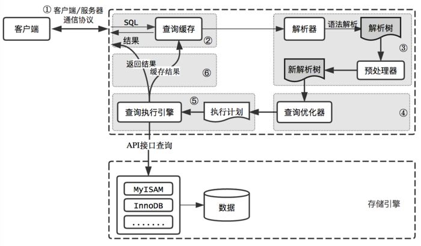
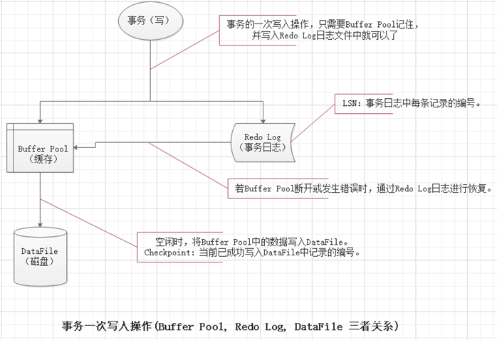
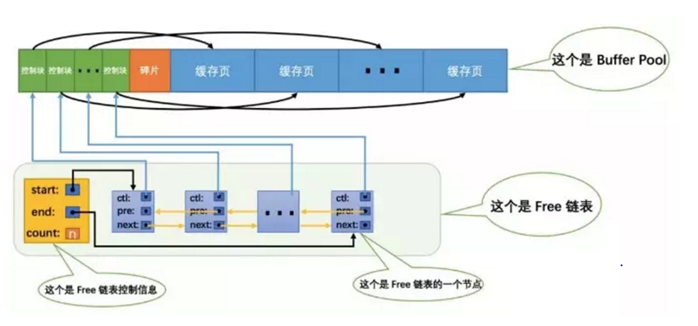
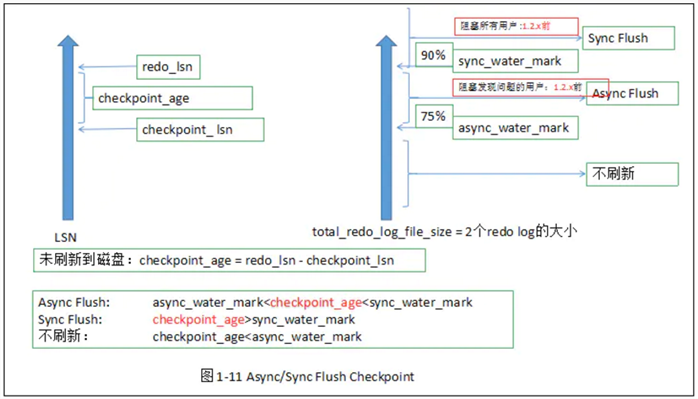
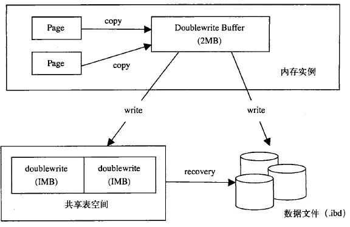

# 数据库知识综合

<!-- TOC -->

- [数据库知识综合](#数据库知识综合)
    - [数据库基础](#数据库基础)
    - [SQL](#sql)
    - [SQL 操作过程中的性能优化方法](#sql-操作过程中的性能优化方法)
    - [MySQL相关](#mysql相关)
        - [MySQL架构](#mysql架构)
        - [MySQL 性能优化](#mysql-性能优化)
        - [MySQL复制原理及流程](#mysql复制原理及流程)
        - [MySQL 事务与日志](#mysql-事务与日志)
        - [MySQL数据库引擎](#mysql数据库引擎)
        - [MySQL数据维护](#mysql数据维护)
        - [MySQL索引](#mysql索引)
        - [MySQL数据库锁](#mysql数据库锁)
        - [MySQL MVCC](#mysql-mvcc)
    - [MySQL异常处理](#mysql异常处理)
        - [MySQL周边工具](#mysql周边工具)
    - [参考](#参考)

<!-- /TOC -->


## 数据库基础  
- 数据库范式  
&emsp;范式，即Normal Form，指的是我们在构建数据库所需要遵守的规则和指导方针。
首先要明确的是：满足第三范式，那么就一定满足第二范式、满足第二范式就一定满足第一范式
&emsp;第一范式：字段是最小的的单元不可再分。即列的原子性。
学生信息组成学生信息表，有年龄、性别、学号等信息组成。这些字段都不可再分，所以它是满足第一范式的
&emsp;第二范式：满足第一范式,表中的字段必须完全依赖于全部主键而非部分主键。
比如一个订单表中有主键（订单id，商品id）和单位价格、折扣、数量、产品名称、产品保质期。保质期只依赖于商品id，不符合第二范式。
&emsp;第三范式：满足第二范式，非主键外的所有字段必须互不依赖
换句话说：数据只能存在一个表中，消除互相依赖
比如大学学院表中包含了学院id，院领导，院简介，如果在学生信息表中也包括了院领导，院简介这些字段，这就重复了。
- MySQL事务特性  
  数据库事务transanction正确执行的四个基本要素。ACID,持久性(Durability)、原子性(Atomicity)、一致性(Correspondence)、隔离性(Isolation)。
  - 持久性: 在事务完成以后，该事务所对数据库所作的更改便持久的保存在数据库之中，并不会被回滚。
  - 原子性: 整个事务中的所有操作，要么全部完成，要么全部不完成，不可能停滞在中间某个环节。事务在执行过程中发生错误，会被回滚（Rollback）到事务开始前的状态，就像这个事务从来没有执行过一样。
  - 一致性: 在事务开始之前和事务结束以后，数据库的完整性约束没有被破坏。
  - 隔离性: 隔离状态执行事务，使它们好像是系统在给定时间内执行的唯一操作。如果有两个事务，运行在相同的时间内，执行 相同的功能，事务的隔离性将确保每一事务在系统中认为只有该事务在使用系统。这种属性有时称为串行化，为了防止事务操作间的混淆，必须串行化或序列化请 求，使得在同一时间仅有一个请求用于同一数据。
- 存储过程  
&emsp;存储过程就是一段SQL语句的预编译集合，封装了一组sql语句，实现某些操作，类似于函数的功能。
  - 好处：  
  将代码封装起来，隐藏复杂的商业逻辑  
  预编译，执行效率高  
  可以接受参数，可以回传值
  - 坏处:  
  针对特定的某种数据库，不兼容，难维护  
  - 触发器与存储过程  
&emsp;触发器与存储过程非常相似，触发器也是SQL语句集，两者唯一的区别是触发器不能用EXECUTE语句调用，而是在用户执行Transact-SQL语句时自动触发（激活）执行。触发器是在一个修改了指定表中的数据时执行的存储过程。通常通过创建触发器来强制实现不同表中的逻辑相关数据的引用完整性和一致性。由于用户不能绕过触发器，所以可以用它来强制实施复杂的业务规则，以确保数据的完整性。触发器不同于存储过程，触发器主要是通过事件执行触发而被执行的，而存储过程可以通过存储过程名称名字而直接调用。当对某一表进行诸如UPDATE、INSERT、DELETE这些操作时，SQLSERVER就会自动执行触发器所定义的SQL语句，从而确保对数据的处理必须符合这些SQL语句所定义的规则。  
- 视图
视图是从一个或多个表导出的虚拟的表，具有普通表的结构，但是不实现数据存储。  
  - 作用：  
    直观  
    安全性，暴露出视图，然后把不想让用户看到和修改的内容屏蔽掉  
    独立性，屏蔽了真实表的结构带来的影响。  
  - 缺点：  
    性能差：视图是由一个复杂的多表查询所定义  
    修改限制： 当用户试图修改视图的某些信息时，数据库必须把它转化为对基本表的某些信息的修改
- 事务隔离级别  
  - Read Uncommitted（读取未提交内容）：在该隔离级别，所有事务都可以看到其他未提交事务的执行结果。本隔离级别很少用于实际应用，因为它的性能也不比其他级别好多少。读取未提交的数据，也被称之为脏读（Dirty Read）。
  - Read Committed（读取提交内容）：这是大多数数据库系统的默认隔离级别（但不是MySQL默认的）。它满足了隔离的简单定义：一个事务只能看见已经提交事务所做的改变。这种隔离级别 也支持所谓的不可重复读（Nonrepeatable Read），因为同一事务的其他实例在该实例处理其间可能会有新的commit，所以同一select可能返回不同结果。
  - Repeatable Read（可重读）：这是MySQL的默认事务隔离级别，它确保同一事务的多个实例在并发读取数据时，会看到同样的数据行。不过理论上，这会导致另一个棘手的问题：幻读 （Phantom Read）。简单的说，幻读指当用户读取某一范围的数据行时，另一个事务又在该范围内插入了新行，当用户再读取该范围的数据行时，会发现有新的“幻影” 行。InnoDB和Falcon存储引擎通过多版本并发控制（MVCC，Multiversion Concurrency Control）机制解决了该问题。
  - Serializable（可串行化）：这是最高的隔离级别，它通过强制事务排序，使之不可能相互冲突，从而解决幻读问题。简言之，它是在每个读的数据行上加上共享锁。在这个级别，可能导致大量的超时现象和锁竞争。

  这四种隔离级别采取不同的锁类型来实现，若读取的是同一个数据的话，就容易发生问题。例如：脏读(Drity Read)：某个事务已更新一份数据，另一个事务在此时读取了同一份数据，由于某些原因，前一个RollBack了操作，则后一个事务所读取的数据就会是不正确的。不可重复读(Non-repeatable read):在一个事务的两次查询之中数据不一致，这可能是两次查询过程中间插入了一个事务更新的原有的数据。幻读(Phantom Read):在一个事务的两次查询中数据笔数不一致，例如有一个事务查询了几列(Row)数据，而另一个事务却在此时插入了新的几列数据，先前的事务在接下来的查询中，就会发现有几列数据是它先前所没有的。

|                 |脏读|不可重复读	| 幻读 |    	
|-----            |---|---	       |---	 |
| Read uncommitted| √ | √	         |   	√| 	
| Read committed  | × | √  	       |    √|
| Repeatable read |×  |×           |   √ |
| Serializable 	  | × |  ×         |   × |
|
    - Read committed要求必须读取已提交的数据。  
    - Repeatable read要求读取过程中，其他事务不能修改(图中第一次读取第二次读取中间都算读取过程)，然而读取-写入却不算在内，因此依然有幻读风险。
    - Serializable要求按串行读取，效率低。
- MySQL存储引擎  
最常见的是InnoDB和MyISAM

|特性|Innodb|	myisam|
|-|----|---------|
|事务 |	支持|	不支持|
|外键	|支持	|不支持|
|全文本搜索|不支持|	支持|
|使用场景	|频繁修改	|查询和插入为主|
|锁级别|行级别|表级别|
|Mvcc|支持|不支持|
|多种行格式|支持| 不支持|
|表类型|索引组织表|堆表|
|文件拷贝迁移|不支持|支持|
|

&emsp;另外还有MEMORY，存储在内存中，速度快，安全性不高  
1.InnoDB：默认存储引擎，使用最广泛。  具有四大特性:  
  1. .插入缓冲（insert buffer)  
  2.  二次写(double write)  
  3. 自适应哈希索引(ahi)  
  4. 预读(read ahead)  
  
2.MyISAM：表锁，不支持事务。  
3.Archive：适合日志和数据采集类应用。  
4.Memory：适合访问速度快，数据丢失也没有关系的场景。  
5.CSV：将普通csv保存再MySQL中，主要用于数据交换。    
&emsp;此外还有：Blackhole、Federated、Merge、NDB等存储引擎。

MySQL InooDB和MyISAM存储引擎区别  
   - - 存储结构
   MyISAM：每个MyISAM在磁盘上存储成三个文件。第一个文件的名字以表的名字开始，扩展名指出文件类型。.frm文件存储表定义。数据文件的扩展名为.MYD (MYData)。索引文件的扩展名是.MYI (MYIndex)。  
  InnoDB：所有的表都保存在同一个数据文件中（也可能是多个文件，或者是独立的表空间文件），InnoDB表的大小只受限于操作系统文件的大小，一般为2GB。
      -  存储空间  
      MyISAM：可被压缩，存储空间较小。支持三种不同的存储格式：静态表(默认，但是注意数据末尾不能有空格，会被去掉)、动态表、压缩表。  
      InnoDB：需要更多的内存和存储，它会在主内存中建立其专用的缓冲池用于高速缓冲数据和索引
      - 可移植性、备份及恢复  
      MyISAM：数据是以文件的形式存储，所以在跨平台的数据转移中会很方便。在备份和恢复时可单独针对某个表进行操作。  
      InnoDB：免费的方案可以是拷贝数据文件、备份 binlog，或者用 mysqldump，在数据量达到几十G的时候就相对痛苦了。
      - 事务支持 
      MyISAM：强调的是性能，每次查询具有原子性,其执行数度比InnoDB类型更快，但是不提供事务支持。  
      InnoDB：提供事务支持事务，外部键等高级数据库功能。 具有事务(commit)、回滚(rollback)和崩溃修复能力(crash recovery capabilities)的事务安全(transaction-safe (ACID compliant))型表。
      - AUTO_INCREMENT 
      MyISAM：可以和其他字段一起建立联合索引。引擎的自动增长列必须是索引，如果是组合索引，自动增长可以不是第一列，他可以根据前面几列进行排序后递增。  
      InnoDB：InnoDB中必须包含只有该字段的索引。引擎的自动增长列必须是索引，如果是组合索引也必须是组合索引的第一列。
      - 表锁差异  
      MyISAM：只支持表级锁，用户在操作myisam表时，select，update，delete，insert语句都会给表自动加锁，如果加锁以后的表满足insert并发的情况下，可以在表的尾部插入新的数据。  
      InnoDB：支持事务和行级锁，是innodb的最大特色。行锁大幅度提高了多用户并发操作的新能。但是InnoDB的行锁，只是在WHERE的主键是有效的，非主键的WHERE都会锁全表的
      - 全文索引  
      MyISAM：支持 FULLTEXT类型的全文索引
      InnoDB：5.7之后支持FULLTEXT类型的全文索引
      - 表主键  
      MyISAM：允许没有任何索引和主键的表存在，索引都是保存行的地址。  
      InnoDB：如果没有设定主键或者非空唯一索引，就会自动生成一个6字节的主键(用户不可见)，数据是主索引的一部分，附加索引保存的是主索引的值。
      - 表的具体行数   
      MyISAM：保存有表的总行数，如果select count(*) from table;会直接取出出该值。
      InnoDB：没有保存表的总行数，如果使用select count(*) from table；就会遍历整个表，消耗相当大，但是在加了wehre条件后，myisam和innodb处理的方式都一样。
      - CURD操作  
      MyISAM：如果执行大量的SELECT，MyISAM是更好的选择。  
      InnoDB：如果你的数据执行大量的INSERT或UPDATE，出于性能方面的考虑，应该使用InnoDB表。DELETE 从性能上InnoDB更优，但DELETE FROM table时，InnoDB不会重新建立表，而是一行一行的删除，在innodb上如果要清空保存有大量数据的表，最好使用truncate table这个命令。
      - 外键
      MyISAM：不支持  
      InnoDB：支持
      - 崩溃自动恢复  
      MyISAM：不支持    
      InnoDB：支持  
  - Innodb的读写参数优化  
  > 读参数

   ```
    # global buffer 以及 local buffer；
    # Global buffer：
    Innodb_buffer_pool_size
    innodb_log_buffer_size
    innodb_additional_mem_pool_size
    # local buffer(下面的都是 server 层的 session 变量，不是 innodb 的)：
    Read_buffer_size
    Join_buffer_size
    Sort_buffer_size
    Key_buffer_size
    Binlog_cache_size
  ```

  > 写参数  

  ```
  innodb_flush_log_at_trx_commit
  innodb_buffer_pool_size  
  insert_buffer_size
  innodb_double_write
  innodb_write_io_thread
  innodb_flush_method
  ```
  >IO 相关
  ```
  innodb_write_io_threads = 8
innodb_read_io_threads = 8
innodb_thread_concurrency = 0
Sync_binlog
Innodb_flush_log_at_trx_commit
Innodb_lru_scan_depth
Innodb_io_capacity
Innodb_io_capacity_max
innodb_log_buffer_size
innodb_max_dirty_pages_pct
  ```
  > 缓存参数和缓存适用场景
  ```
  query cache/query_cache_type

并不是所有表都适合使用query cache。造成query cache失效的原因主要是相应的table发生了变更

第一个：读操作多的话看看比例，简单来说，如果是用户清单表，或者说是数据比例比较固定，比如说商品列表，是可以打开的，前提是这些库比较集中，数据库中的实务比较小。

第二个：我们“行骗”的时候，比如说我们竞标的时候压测，把query cache打开，还是能收到qps激增的效果，当然前提示前端的连接池什么的都配置一样。大部分情况下如果写入的居多，访问量并不多，那么就不要打开，例如社交网站的，10%的人产生内容，其余的90%都在消费，打开还是效果很好的，但是你如果是qq消息，或者聊天，那就很要命。

第三个：小网站或者没有高并发的无所谓，高并发下，会看到 很多 qcache 锁 等待，所以一般高并发下，不建议打开query cache
  ```
  > Innodb行锁的实现
  ```
  InnoDB是基于索引来完成行锁

例: select * from tab_with_index where id = 1 for update;  
for update 可以根据条件来完成行锁锁定，并且 id 是有索引键的列，如果 id 不是索引键那么InnoDB将完成表锁，并发将无从谈起
  ```
- MySQL乐观锁和悲观锁  
  悲观锁和乐观锁都是为保证一致性的一种锁。
  - 悲观锁  
  ```
  1.关闭autocommit=0;
  2.在事务中使用 select .. from … where … for update;给行加排他锁  
  3.select命中的行必须有索引，否则会锁表  
  优点：  
    1.保守策略，所以数据安全性高  
  缺点：
    1.有加锁等额外开销，效率低
    2.可能引起死锁
    3.降低并行行，数据被锁住后其他事物必须等待
  ```
  
  - 乐观锁
```
使用：
  1.表中增加版本号或时间戳数据列
  2.读取数据是同时读取版本号
  3.更新数据时添加版本号为条件，同时版本号增加1
  4.如果更更新失败，提示用户
优点：
  1.没有锁，效率高
  2.不会引起死锁
缺点：
1.这里是列表文本遇到两个事务统一时间读取一行数据时，会引起问题
```
- MySQL索引    
&emsp;mysql 索引类型有:
1.主键索引  
2.普通索引  
3.唯一索引  
4.全文索引  
&emsp;索引本身就是一种数据结构，用于加快查找速度，InnoDB和MyISAM都是用的B+树。
经常需要查询，经常使用SELECT和WHERE操作时，可以使用索引
经常做表连接
经常出现在order by、group by、distinct 后面的字段中，可以建立索引  
&emsp;索引的缺点在于：增删改浪费时间，构建索引需要占据空间
构建索引常用的数据结构

| 结构| 区别| 
|----|--- |
|Hash|只存储对应的哈希值，查找速度快，不能排序,不能进行范围查询|
|B+|数据有序,范围查询|  

 聚集索引和非聚集索引的区别
 
|索引|	区别|
|---|----|
|聚集索引|	数据按索引顺序存储，数据行的物理顺序与列值的顺序相同
|非聚集索引|	存储指向真正数据行的指针
|
聚簇索引的叶节点就是数据节点，而非聚簇索引的叶节点仍然是索引节点，并保留一个链接指向对应数据块。  
MyISAM的是非聚簇索引，B+Tree的叶子节点上的data，并不是数据本身，而是数据存放的地址。  
InnoDB使用的是聚簇索引，将主键组织到一棵B+树中，而行数据就储存在叶子节点上  
MySQL InnoDB一定会建立聚簇索引，把实际数据行和相关的键值保存在一块，这也决定了一个表只能有一个聚簇索引  
1.InnoDB通常根据主键值(primary key)进行聚簇  
2.如果没有创建主键，则会用一个唯一且不为空的索引列做为主键，成为此表的聚簇索引  
3.上面二个条件都不满足，InnoDB会自己创建一个虚拟的聚集索引  
聚簇索引的  
优点：就是提高数据访问性能。  
缺点：维护索引很昂贵，特别是插入新行或者主键被更新导至要分页(page split)的时候。


索引底层用B+树而不是用红黑树

|树	|区别|
|---|---|
|红黑树	|增加，删除，红黑树会进行频繁的调整，来保证红黑树的性质，浪费时间|
B树也就是B-树	|B树，查询性能不稳定，查询结果高度不致，每个结点保存指向真实数据的指针，相比B+树每一层每屋存储的元素更多，显得更高一点。|
B+树	|B+树相比较于另外两种树,显得更矮更宽，查询层次更浅|
|
 
| B树和 B+树区别
  第一，B 树一个节点里存的是数据，而 B+树存储的是索引（地址），所以 B 树里一个节点存不了很多个数据，但是 B+树一个节点能存很多索引，B+树叶子节点存所有的数据。  
  第二，B+树的叶子节点是数据阶段用了一个链表串联起来，便于范围查找。

  通过 B 树和 B+树的对比我们看出，B+树节点存储的是索引，在单个节点存储容量有限的情况下，单节点也能存储大量索引，使得整个 B+树高度降低，减少了磁盘 IO。其次，B+树的叶子节点是真正数据存储的地方，叶子节点用了链表连接起来，这个链表本身就是有序的，在数据范围查找时，更具备效率。因此 Mysql 的索引用的就是 B+树，B+树在查找效率、范围查找中都有着非常不错的性能。

索引失效的条件    
 - 在where子句中进行null值判断
 - 避免在where子句中使用or来连接条件,因为如果俩个字段中有一个没有索引的话,引擎会放弃索引而产生全表扫描
 - 避免在where子句中使用like模糊查询
  
- 数据库连接池  
维护一定数量的连接，减少重新创建连接的时间
- MVCC  
使用MVCC时，不会直接用新数据覆盖旧数据，而是将旧数据标记为过时并在别处增加新版本的数据。允许读者读取在他读之前已经存在的数据，即使这些在读的过程中半路被别人修改、删除了，也对先前正在读的用户没有影响。
## SQL
- SQL JOIN 的可视化  
  

sql join 的sql语句如下[1]：  

```
SELECT <select_list> FROM TableA A LEFT JOIN TABLEB B ON A.key=B.key
```
```
SELECT <select_list>  FROM Table_A A INNER JOIN Table_B B ON A.Key = B.Key
```
```
SELECT <select_list> FROM Table_A A RIGHT JOIN Table_B B
ON A.Key = B.Key
```
```
SELECT <select_list> FROM Table_A A FULL OUTER JOIN Table_B B
ON A.Key = B.Key
```
```
SELECT <select_list>  FROM Table_A A LEFT JOIN Table_B B ON A.Key = B.Key
WHERE B.Key IS NULL
```
```
SELECT <select_list> FROM Table_A A RIGHT JOIN Table_B B ON A.Key = B.Key
WHERE A.Key IS NULL
```
```
SELECT <select_list> FROM Table_A A FULL OUTER JOIN Table_B B
ON A.Key = B.Key
WHERE A.Key IS NULL OR B.Key IS NULL
```
 - &emsp;对于mysql数据库中的join实现算法为`Nested-loop join Algorithms` [2],根据该算法的实现逻辑在执行mysql join操作时实际上是执行循环对比，因此优化的思路和目标即是尽量将循环的次数变小。在优化join操作时典型的优化方法有：  
    -   尽量选择小表作为驱动表
      - 对被驱动表的join字段添加索引
  
- SQL中高效率获取随机N调数据
```
SELECT *
FROM `TABLE_NAME` AS t1 JOIN (SELECT ROUND(RAND() * (SELECT MAX(id) FROM `TABLE_NAME`)) AS id) AS t2
WHERE t1.id >= t2.id
ORDER BY t1.id ASC LIMIT 4;
或
SELECT * FROM `TABLE_NAME` 
WHERE id >= (SELECT floor(RAND() * (SELECT MAX(id) FROM `TABLE_NAME`)))  and city="city_91" and showSex=1
ORDER BY id LIMIT 4;
或 
SELECT * FROM TABLE_NAME 
WHERE id >= ((SELECT MAX(id) FROM TABLE_NAME)-(SELECT MIN(id) FROM TABLE_NAME)) * RAND() + (SELECT MIN(id) FROM TABLE_NAME)
limit 5;
或
SELECT *
FROM `TABLE_NAME` AS t1 JOIN (SELECT ROUND(RAND() * (
(SELECT MAX(id) FROM `TABLE_NAME` where id<1000 )-(SELECT MIN(id) FROM `TABLE_NAME` where id<1000 ))+(SELECT MIN(id) FROM `TABLE_NAME` where id<1000 )) AS id) AS t2
WHERE t1.id >= t2.id
ORDER BY t1.id LIMIT 5;
```
## SQL 操作过程中的性能优化方法
**sql 查询的优化的主要方向在优化索引的使用和避免全表扫描**
  - join操作时
      - 尽量选择小表作为驱动表
      - 对被驱动表的join字段添加索引
  - select 查询操作
    - 采用limit进行分页查询时结合使用order by id 索引 如  
  ```
  select id from A order by id limit 90000,10;
  或
  select id from A order by id  between 90000 and 90010;
  ```
  - 采用top或limit限制查询结果
    ```
    SELECT id FROM A LIKE 'abc%' limit 1
    ```
  - 查询尽量不要使用select * 进行查询
  ```
  SELECT <select_field> FROM TABLE
  ```
 - like查询时尽量避免%filed%查询，最好单侧执行%
  ```
  SELECT <select_file> FROM TABLE LIKE 'FILED%'
或
  SELECT <select_file> FROM TABLE LIKE '%FILED'

  ```
  - 在where子句中使用or时可以考虑采用union all 或union方式进行替换
```
SELECT id FROM TABLEA WHERE field= A or field = B 修改为
SELECT id FROM TABLEA WHERE  field= A union all SELECT id FROM TABLEA WHERE field=B 
```
 - IS NULL 或 IS NOT NULL 子句中尽量修改为特殊值查询 如将IS NULL 字段置为0 从而避免全表扫描
  ```
  SELECT id FROM A WHERE filed IS NULL 修改为
  SELECT id FROM A WHERE field = 0
  ```
- WHERE 子句中尽量避免使用函数计算，将确定值作为where子句的查询条件
  ```
  SELECT id FROM A WHERE year(addate) <2020 修改为
  SELECT id FROM A where addate<'2020-01-01'
  ```
- 多字段排序问题
  - mysql查询时是只会使用一个索引，如果where子句中已经使用了索引，那么在order by时是不会使用索引的，尽量避免执行多字段的排序操作，不得己时简易对排序字段建立复合索引

- 尽量使用union all替换union
  - union操作会将两个或多个结果集再合并后在进行唯一性过滤，这一过程会设计到排序以及大量的cpu计算。当确认不会出现重复结果集或重复结果集不重要的情况下，使用union all替换union
- inner join与outer join
  - 尽量使用inner join
  - 使用join时，选择小表作为驱动表
- exits与in 比较
  ```
  SELECT * from A WHERE id in ( SELECT id from B )
  ```
  - select in 是在内存中进行遍历比较，exists需要查询数据库，当B表中数据比较大是exits效率优于in；而B表数据比A小的情况下用in比较适合。
## MySQL相关
### MySQL架构



>
>1. connectors
与其他编程语言中的sql 语句进行交互，如php、java等
>2. Management Serveices & Utilities
系统管理和控制工具
>3. Connection Pool (连接池)
管理缓冲用户连接，线程处理等需要缓存的需求
>4. SQL Interface (SQL接口)
接受用户的SQL命令，并且返回用户需要查询的结果。比如select from就是调用SQL Interface
>5. Parser （解析器）
SQL命令传递到解析器的时候会被解析器验证和解析。
主要功能：
a . 将SQL语句分解成数据结构，并将这个结构传递到后续步骤，后面SQL语句的传递和处理就是基于这个结构的
b.  如果在分解构成中遇到错误，那么就说明这个sql语句是不合理的，语句将不会继续执行下去
> 6. Optimizer (查询优化器)
SQL语句在查询之前会使用查询优化器对查询进行优化(产生多种执行计划,最终数据库会选择最优化的方案去执行,尽快返会结果) 他使用的是“选取-投影-联接”策略进行查询。
用一个例子就可以理解：select uid,name from user where gender = 1;
这个select 查询先根据where 语句进行选取，而不是先将表全部查询出来以后再进行gender过滤
这个select查询先根据uid和name进行属性投影，而不是将属性全部取出以后再进行过滤
将这两个查询条件联接起来生成最终查询结果.
>7. Cache和Buffer (查询缓存)
如果查询缓存有命中的查询结果，查询语句就可以直接去查询缓存中取数据。
这个缓存机制是由一系列小缓存组成的。比如表缓存，记录缓存，key缓存，权限缓存等
>8.Engine (存储引擎)
存储引擎是MySql中具体的与文件打交道的子系统。也是Mysql最具有特色的一个地方。
Mysql的存储引擎是插件式的。它根据MySql AB公司提供的文件访问层的一个抽象接口来定制一种文件访问机制（这种访问机制就叫存储引擎）
SQL 语句执行过程
数据库通常不会被直接使用，而是由其他编程语言通过SQL语句调用mysql，由mysql处理并返回执行结果。那么Mysql接受到SQL语句后，又是如何处理
首先程序的请求会通过mysql的connectors与其进行交互，请求到处后，会暂时存放在连接池（connection pool)中并由处理器（Management Serveices & Utilities）管理。当该请求从等待队列进入到处理队列，管理器会将该请求丢给SQL接口（SQL Interface）。SQL接口接收到请求后，它会将请求进行hash处理并与缓存中的结果进行对比，如果完全匹配则通过缓存直接返回处理结果；否则，需要完整的走一趟流程：
(1)由SQL接口丢给后面的解释器（Parser），解释器会判断SQL语句正确与否，若正确则将其转化为数据结构。
(2)解释器处理完，便来到后面的优化器（Optimizer），它会产生多种执行计划,最终数据库会选择最优化的方案去执行,尽快返会结果。
(3)确定最优执行计划后，SQL语句此时便可以交由存储引擎（Engine）处理，存储引擎将会到后端的存储设备中取得相应的数据，并原路返回给程序。
### MySQL 性能优化
- 选择合适的存储引擎，通常使用InnoDB  
 MyISAM 只缓存索引，而 InnoDB 缓存数据和索引，MyISAM 不支持事务；
- 为每个表分别创建 InnoDB FILE  
这样可以保证 ibdata1 文件不会过大，失去控制。尤其是在执行 mysqlcheck -o –all-databases 的时候,设置方法如下
```
innodb_file_per_table=1
```
- 设置合适的innodb_buffer_pool_size 以尽量保证从内存中读取数据而不是从磁盘中读取数据  
在设置上述参数时也要注意调整服务器本身的内存设置，如`执行 echo 1 > /proc/sys/vm/drop_caches 清除操作系统的文件缓存` 后查看服务器可用内存，  并且需要执行数据预热处理。
- 关闭swap分区，尽量避免数据存储在swap分区中
- 定期优化和重建数据库   
mysqlcheck -o –all-databases 会让 ibdata1 不断增大，真正的优化只有重建数据表结构.
- 减少磁盘写入操作
  - 使用足够大的写入缓存 innodb_log_file_size
  - innodb_flush_log_at_trx_commit
  - 避免双写入缓冲 `innodb_flush_method=O_DIRECT`
  - 提高磁盘读写速度
- 充分利用索引
- 分析查询日志和慢查询日志
- 架构优化
  - 分库分表（垂直，水平）
  - 缓存
  - 读写分离
  - 主从复制
- 配置优化
  - 数据库配置优化
  ```
  Linux系统中MySQl配置文件一般位于/etc/my.cnf
  常用配置参数：
  innodb_buffer_pool_size【用于配置Innodb的缓 冲池,如果数据库中只有Innodb表，则推荐配置量为总内存的75%】
  innodb_buffer_pool_instances【MySQL5.5中新增参数，可以控制缓冲池的个数，默认情况下只有一个缓冲池】
  innodb_flush_log_at_trx_commit【关键参数，对innodb的IO影响很大。默认值为1，可以取0,1,2三个值，0最快，1最安全，2折中。一般建议设为2，但如果数据安全性要求比较高则使用默认值1】
  ```
  - 操作系统配置优化
  ```
  网络方面的配置，要修改/etc/sysctl.conf文件
  增加tcp支持的队列数
  net.ipv4.tcp_max_syn_backlog = 65535
  减少断开连接时 ，资源回收
  net.ipv4.tcp_max_tw_buckets = 8000
  net.ipv4.tcp_tw_reuse = 1
  net.ipv4.tcp_tw_recycle = 1
  net.ipv4.tcp_fin_timeout = 10
   ```
- 优化顺序和优化思路  
1. 发现有问题的SQL   
 读取MYSQL的慢查询日志，记录在MySQL中响应时间超过阈值的语句，可以查询出执行的次数多占用的时间长的SQL。
2. 通过EXPLAIN关键字分析SQL  
使用 EXPLAIN 关键字可以知道MySQL是如何处理你的SQL语句的
3. 进行优化
- MySQL EXPLAIN使用和解析  
  > id：每个被独立执行的操作的标志，表示对象被操作的顺序。一般来说， id 值大，先被执行；如果 id 值相同，则顺序从上到下。  
  select_type：查询中每个 select 子句的类型。  
  table：名字，被操作的对象名称，通常的表名(或者别名)，但是也有其他格式。  
  partitions：匹配的分区信息。  
  type:join 类型。  
  possible_keys：列出可能会用到的索引。  
  key：实际用到的索引。  
  key_len：用到的索引键的平均长度，单位为字节。  
  ref：表示本行被操作的对象的参照对象，可能是一个常量用 const 表示，也可能是其他表的  
  key：指向的对象，比如说驱动表的连接列。  
  rows：估计每次需要扫描的行数。  
  filtered:rows*filtered/100 表示该步骤最后得到的行数(估计值)。  
  extra：重要的补充信息。  

  - Explain 结果中，一般来说，要看到尽量用 index(type 为 const、 ref 等， key 列有值)，避免使用全表扫描(type 显式为 ALL)。比如说有 where 条件且选择性不错的列，需要建立索引。
  被驱动表的连接列，也需要建立索引。被驱动表的连接列也可能会跟 where 条件列一起建立联合索引。当有排序或者 group by 的需求时，也可以考虑建立索引来达到直接排序和汇总的需求。
- MySQL Profile分析
  > Profile 用来分析 sql 性能的消耗分布情况。当用 explain 无法解决慢 SQL 的时候，需要用profile 来对 sql 进行更细致的分析，找出 sql 所花的时间大部分消耗在哪个部分，确认 sql的性能瓶颈
### MySQL复制原理及流程
 - 复制基本原理流程  
  1.主：binlog线程——记录下所有改变了数据库数据的语句，放进master上的binlog中;  
  2.从：io线程——在使用start slave 之后，负责从master上拉取 binlog 内容，放进 自己的relay log中;  
  3.从：sql执行线程——执行relay log中的语句;  
- MySQL复制的线程有几个及之间的关联  
   > MySQL 的复制是基于如下 3 个线程的交互（ 多线程复制里面应该是 4 类线程）：  
  1.Master 上面的 binlog dump 线程，该线程负责将 master 的 binlog event 传到slave；  
  2.Slave 上面的 IO 线程，该线程负责接收 Master 传过来的 binlog，并写入 relay log；  
  3.Slave 上面的 SQL 线程，该线程负责读取 relay log 并执行；
  4.如果是多线程复制，无论是 5.6 库级别的假多线程还是 MariaDB 或者 5.7 的真正的多线程复制， SQL 线程只做 coordinator，只负责把 relay log 中的 binlog读出来然后交给 worker 线程， woker 线程负责具体 binlog event 的执行
- MySQL如何保证复制过程中数据一致性及减少数据同步延时  
  >一致性主要有以下几个方面
  1.在 MySQL5.5 以及之前， slave 的 SQL 线程执行的 relay log 的位置只能保存在文件（ relay-log.info）里面，并且该文件默认每执行 10000 次事务做一次同步到磁盘， 这意味着 slave 意外 crash 重启时， SQL 线程执行到的位置和数据库的数据是不一致的，将导致复制报错，如果不重搭复制，则有可能会导致数据不一致。 MySQL 5.6 引入参数 relay_log_info_repository，将该参数设置为 TABLE 时， MySQL 将 SQL 线程执行到的位置存到mysql.slave_relay_log_info 表，这样更新该表的位置和 SQL 线程执行的用户事务绑定成一个事务，这样 slave 意外宕机后， slave 通过 innodb 的崩溃恢复可以把 SQL 线程执行到的位置和用户事务恢复到一致性的状态。  
  1). MySQL 5.6 引入 GTID 复制，每个 GTID 对应的事务在每个实例上面最多执行一次， 这极大地提高了复制的数据一致性；
  2).MySQL 5.5 引入半同步复制， 用户安装半同步复制插件并且开启参数后，设置超时时间，可保证在超时时间内如果 binlog 不传到 slave 上面，那么用户提交事务时不会返回，直到超时后切成异步复制，但是如果切成异步之前用户线程提交时在 master 上面等待的时候，事务已经提交，该事务对 master 上面的其他 session 是可见的，如果这时 master 宕机，那么到 slave 上面该事务又不可见了，该问题直到 5.7 才解决；
  3).MySQL 5.7 引入无损半同步复制，引入参rpl_semi_sync_master_wait_point，该参数默认为 after_sync，指的是在切成半同步之前，事务不提交，而是接收到 slave 的 ACK 确认之后才提交该事务，从此，复制真正可以做到无损的了。
  5.可以再说一下 5.7 的无损复制情况下， master 意外宕机，重启后发现有 binlog没传到 slave 上面，这部分 binlog 怎么办？？？分 2 种情况讨论， 1 宕机时已经切成异步了， 2 是宕机时还没切成异步？？？ 这个怎么判断宕机时有没有切成异步呢？？？ 分别怎么处理？？？  
延时性  
5.5 是单线程复制， 5.6 是多库复制（对于单库或者单表的并发操作是没用的）， 5.7 是真正意义的多线程复制，它的原理是基于 group commit， 只要 master 上面的事务是 group commit 的，那 slave 上面也可以通过多个 worker线程去并发执行。 和 MairaDB10.0.0.5 引入多线程复制的原理基本一样。  
### MySQL 事务与日志
- 日志类型  
  > 1.redo  
  2.undo  
- 日志存放形式  
  >  - redo：在页修改的时候，先写到 redo log buffer 里面， 然后写到 redo log 的文件系统缓存里面(fwrite)，然后再同步到磁盘文件（ fsync）。
  >  - Undo:在 MySQL5.5 之前， undo 只能存放在 ibdata文件里面， 5.6 之后，可以通过设置 innodb_undo_tablespaces 参数把 undo log 存放在 ibdata之外。
- 事务是如何通过日志实现的  
  > 因为事务在修改页时，要先记 undo，在记 undo 之前要记 undo 的 redo， 然后修改数据页，再记数据页修改的 redo。 Redo（里面包括 undo 的修改） 一定要比数据页先持久化到磁盘。 当事务需要回滚时，因为有 undo，可以把数据页回滚到前镜像的 状态，崩溃恢复时，如果 redo log 中事务没有对应的 commit 记录，那么需要用 undo把该事务的修改回滚到事务开始之前。 如果有 commit 记录，就用 redo 前滚到该事务完成时并提交掉。
- binlog的日志格式以及区别  
> 1.Statement：每一条会修改数据的sql都会记录在binlog中。
  - 优点：不需要记录每一行的变化，减少了binlog日志量，节约了IO，提高性能。(相比row能节约多少性能 与日志量，这个取决于应用的SQL情况，正常同一条记录修改或者插入row格式所产生的日志量还小于Statement产生的日志量， 但是考虑到如果带条 件的update操作，以及整表删除，alter表等操作，ROW格式会产生大量日志，因此在考虑是否使用ROW格式日志时应该跟据应用的实际情况，其所 产生的日志量会增加多少，以及带来的IO性能问题。)
 - 缺点：由于记录的只是执行语句，为了这些语句能在slave上正确运行，因此还必须记录每条语句在执行的时候的 一些相关信息，以保证所有语句能在slave得到和在master端执行时候相同 的结果。另外mysql 的复制,像一些特定函数功能，slave可与master上要保持一致会有很多相关问题(如sleep()函数， last_insert_id()，以及user-defined functions(udf)会出现问题).  
使用以下函数的语句也无法被复制：  
  LOAD_FILE()  
  UUID()  
  USER()  
  FOUND_ROWS()  
  SYSDATE() (除非启动时启用了 —sysdate-is-now 选项) 同时在INSERT …SELECT 会产生比 RBR 更多的行级锁  
>2.Row:不记录sql语句上下文相关信息，仅保存哪条记录被修改。

- 优点：binlog中可以不记录执行的sql语句的上下文相关的信息，仅需要记录那一条记录被修改成什么了。所以rowlevel的日志内容会非常清楚的记录下 每一行数据修改的细节。而且不会出现某些特定情况下的存储过程，或function，以及trigger的调用和触发无法被正确复制的问题

- 缺点：所有的执行的语句当记录到日志中的时候，都将以每行记录的修改来记录，这样可能会产生大量的日志内容,比 如一条update语句，修改多条记录，则binlog中每一条修改都会有记录，这样造成binlog日志量会很大，特别是当执行alter table之类的语句的时候，由于表结构修改，每条记录都发生改变，那么该表每一条记录都会记录到日志中。
- 3.Mixedlevel: 是以上两种level的混合使用，一般的语句修改使用statment格式保存binlog，如一些函数，statement无法完成主从复制的操作，则 采用row格式保存binlog,MySQL会根据执行的每一条具体的sql语句来区分对待记录的日志形式，也就是在Statement和Row之间选择 一种.新版本的MySQL中队row level模式也被做了优化，并不是所有的修改都会以row level来记录，像遇到表结构变更的时候就会以statement模式来记录。至于update或者delete等修改数据的语句，还是会记录所有行的变更。

- 适用场景
在一条 SQL 操作了多行数据时， statement 更节省空间， row 更占用空间。但是 row模式更可靠。  

### MySQL数据库引擎
- Innodb底层实现方式
InnoDB核心：（1）日志   （2）内存（缓存池（Buffer Pool））  (3) 磁盘（Datafile）
InnoDB存储引擎有多个内存块，这些内存块组成了一个大的内存池。
后台线程主要负责刷新内存池中的数据，将已修改的数据刷新到磁盘。
当某个事务进行一次写操作时，InnoDB引擎将数据写入redo log后就会提交事务。
而非写入到磁盘（Datafile），之后InnoDB再异步地将新事务的数据异步地写入Datafile，真正存储起来。

A．redo log 和 undo log 和 bin log
用来恢复事务所对应的脏数据块的日志文件。
1. 前滚 与 回滚
- - 前滚
未完全提交的事务，即该事务已经被执行commit命令了。
该事务所对应的脏数据块中只有一部分被写到磁盘上的数据文件中，一部分还在内存中。
若此时数据库实例崩溃，就需要用前滚来完成事务的完全提交。
- - 回滚
未提交的事务，即该事务未被执行commit命令。
2. Redo log
重做日志，提供前滚操作。
Redo log 通常是物理日志，记录的是数据页的物理修改，用来恢复提交后的物理数据页。
恢复数据页、且只能恢复到最后一次提交的位置。
Redo log 包括两部分
内存中的日志缓冲（redo log buffer），该部分日志是易失性的。
磁盘上的重做日志文件（redo log file），该部分日志是持久的。
3. Undo log
回滚日志，提供回滚操作。
Undo log用来回滚行记录到某个版本。
undo log一般是逻辑日志，根据每行记录进行记录。
4. Bin log
二进制日志，记录对数据发生或潜在发生更改的SQL语句，并以二进制的形式保存在磁盘中。
可以用来查看数据库的变更历史（具体的时间点所做的操作），数据库增量备份和恢复。
Show variables like %log_bin% ; 

B．InnoDB内存
1. InnoDB线程
- Master Thread
最核心的线程，主要负责将缓存池中的数据异步刷新到磁盘，保证数据的一致性。
- IO Thread
IO Thread 主要负责大量的异步IO来处理写IO请求。
Purge Thread
Purge Thread回收已经使用并分配的undo页，InnoDB支持多个Purge Thread，这样做可以加快undo页的回收。
- Page Cleaner Thread
Page Cleaner Thread是将之前版本中脏页的刷新操作都放入单独的线程中来完成，减轻Master Thread的工作及对于用户查询线程的阻塞。
2. InnoDB内存模型
InnoDB引擎使用缓存池技术来提高数据库的整体性能。
InnoDB中缓存池页的大小默认为16KB。

计算机科学中著名的局部性原理
当一个数据被用到时，其附近的数据也通常会马上被使用，程序运行期间所需要的数据通常比较集中。
内存 与 磁盘
主存和磁盘是以页为单位交换数据。
当程序要读取的数据不在主存中时，会触发一个缺页异常。
此时系统会向磁盘发出读盘信号，磁盘会找到数据的起始位置并向后连续读取一页或几页载入内存中。
然后异常返回，程序继续运行。
数据库、内存、磁盘
在数据库中进行读取页的操作时，首先将从磁盘读到的页存放在缓存池中。
下一次读取相同的页时，首先判断页是不是在缓存池中。
若在、称该页在缓存池中被命中，直接读取该页。
否则、读取磁盘上的页。

对于数据库中页的修改操作，首先修改在缓存池中的页，然后再以一定的频率刷新到磁盘。 
3. 缓存池（Buffer Pool）
为了更好的管理这些被缓存的页，InnoDB为每一个缓存页都创建了一些控制信息（控制块）。
这些控制信息包括该页所属的表空间编号、页号、页在Buffer Pool中的地址、锁信息、LSN信息等。
每个缓存页对应一个控制块，每个控制块占用的内存大小是相同的，它们都被放到Buffer Pool中，如下图。


4. Free List（空闲链表）
启动MySQL服务器时，需要对Buffer Pool进行初始化，将Buffer Pool划分成若干对控制块和缓存页。
随着程序的运行，会不断的将磁盘上的页缓存到Buffer Pool中，但如何管理Buffer Pool中空闲的缓存页呢？
使用Free List（空闲链表）来管理空闲的缓存页，如下图。


>Free List控制信息：包含链表的头结点地址、尾结点地址、以及当前链表中结点的数量。
每个Free List的结点中都记录了某个缓存页控制块的地址。
每个缓存页控制块都记录着对应的缓存页地址。
每当需要从磁盘中加载一个页到Buffer Pool中时，就从Free List中取一个空闲的缓存页，并且把该缓存页对应的控制块的信息填上，然后把该缓存页对应的Free List结点从Free List链表中删除。
5. Buffer Pool 清理机制

> 缓存命中率：假设一共访问了n次页，那么被访问的页已经在缓存中的次数除以n就是缓存命中率。
InnoDB Buffer Pool采用经典的LRU算法进行页面淘汰，以提高缓存命中率。
LRU（Least Recently Used）：最近最少使用，用来管理缓存池中页的可用性。
如果该页不在Buffer Pool中，在把该页从磁盘加载到Buffer Pool中的缓存页时，就把该缓存页包装成结点塞到链表的头部。
如果该页在Buffer Pool中，则直接把该页对应的LRU链表结点移动到链表的头部。
缺点
若遇一次全表扫描就把热数据给冲完了，就会导致Buffer Pool污染问题，严重的降低了缓存命中率。
Buffer Pool中的所有数据页都被换了一次血，其它查询语句在执行时又得执行一次从磁盘加载到Buffer Pool的操作

midpoint insertion stategy
> InnoDB存储引擎对传统的LRU算法做了一些优化。
在InnoDB中加入了midpoint，新读到的页，虽然是最新访问的页。
但并不直接插入到LRU列表的首部，而是插入到LRU列表的midpoint位置。
默认配置插入到列表长度的 5/8 处，midpoint由参数innodb_old_blocks_pct控制。
Midpoint之前的列表称之为new列表，之后的列表称之为old列表。
可以简单的将new列表中的页理解为最活跃的热点数据。
InnoDB存储引擎还引入了 innodb_old_blocks_time 来表示页读取到mid位置之后需要等待多久才会被加入到LRU列表的热端，可以通过设置该参数保证热点数据不轻易被刷出。

6. FLUSH链表（Flush List）
> FLUSH链表用来管理将页刷新回磁盘，缓存池中通过FLUSH 链表存储需要被刷新到磁盘上的页（脏页）。
这里的脏页指的是此页被加载进Buffer Pool后第一次修改后的页。
只有第一次修改时才需要加入FLUSH链表（第二次修改时已经存在了）。
7. LRU List, Free List, Flush List 三者关系


8. Checkpoint 技术
1) 缩短数据库恢复时间。
 > redo log中记录了Checkpoint的位置。
这个点之前的页已经被刷新回磁盘，只需要对Checkpoint之后的redo log进行恢复。
2) 缓存池不够用时，刷新脏页。
> 根据LRU算法，溢出最近最少使用页。
如果页为脏页，强制执行Checkpoint，将脏页刷新回磁盘。
3) Redo log不可用时，刷新脏页。
> 由于redo log是循环使用的，这部分对应的数据还未刷新到磁盘。
数据库恢复时，如果不需要这部分日志即可被覆盖。
如果需要，必须强制执行Checkpoint，将缓存池中的页至少刷新到当前重做日志的位置。

InnoDB存储引擎内部，有两种Checkpoint
Sharp Checkpoint（默认， innodb_fast_shutdown=1）。
>Sharp Checkpoint发生在数据库关闭时，将所有的脏页都刷新回磁盘。
缺点：不适用于数据库运行时的刷新。

Fuzzy Checkpoint。
> Fuzzy Checkpoint适用于数据库运行时刷新脏页，只刷新一部分脏页。
MasterThread Checkpoint
异步刷新，每秒或每10秒从缓存池脏页列表刷新一定比例的页回磁盘。
FLUSH_LRU_LIST Checkpoint
若Buffer Pool中没有足够的空间时，根据LRU算法、溢出LRU列表尾端的页。
如果这些页有脏页，需要进行Checkpoint（Page Cleaner Thread线程就是做这个事的）。
InnoDB存储引擎需要保证LRU列表中差不多有100个空闲页可供使用。
Innodb_lru_scan_dept ：控制LRU列表中可用页的数量，默认1024。
Asnc / Sync Flush Checkpoint
指重做日志不可用时，需要强制刷新页回磁盘。
此时的页是脏页列表（FLUSH LIST）中选取的。

LSN
> 事务日志中每条记录的编号。
InnoDB存储引擎，通过LSN（Log Sequence Number）来标记版本，LSN是8字节的数字。
redo_lsn ：写入日志的 LSN。
Checkpoint_lsn ：刷新回磁盘的最新页 LSN。

Checkpoint_age = redo_lsn – checkpoint_lsn。
Async_water_mark = 75% * total_redo_file_size。
Sync_water_mark = 90% * total_redo_file_size。
Dirty Page too much Checkpoint

> 即脏页太多，强制checkpoint，保证缓存池中有足够可用的页。
参数设置：innodb_max_dirty_pages_pct = 75。
表示：当缓存池中脏页的数量占75%时，强制checkpoint。1.0x之后默认75。

C．InnoDB关键特性
1. 插入缓存（Insert Buffer）
Insert Buffer的设计，对于非聚集索引的插入和更新操作，不是每次都直接插入到索引页中。
而是先判断插入非聚集索引页是否在缓存池中。
若存在则直接插入，若不存在则先放入一个Insert Buffer对象中。

数据库这个非聚集的索引并没有插入到叶子结点（因为B+树只有叶子结点才存储数据），而是存放在另一个位置。
然后再以一定的频率和情况进行Insert Buffer和辅助索引页子结点的merge（合并）操作。
这时通常能将多个插入合并到一个操作中（因为在一个索引页中），这就大大提高了对于非聚集索引插入的性能。
使用Insert Buffer需要满足两个条件
1) 索引是辅助索引。
2) 索引不是唯一的。
2. 两次写操作
假设有这样一个场景，当数据库正在从内存向磁盘写一个数据页时，数据库宕机。
从而导致这个页只写了部分数据，这就是部分写失效，它会导致数据丢失。
这时是无法通过重做日志（redo log）恢复的。
因为重做日志记录是对页的物理修改，如果页本身已损坏，重做日志也无能为力。

如何解决以上问题 ？
为了解决以上问题，可以使用两次写操作。
因为在磁盘共享表空间中已有数据页副本拷贝，如果数据库在页写入数据文件的过程中宕机。
在实例恢复时，可以从共享表空间中找到该页副本，将其拷贝覆盖原有的数据页，再应用重做日志即可。

两次写原理。
1) 当刷新缓存池脏页时，并不直接写到数据文件中，而是先拷贝至内存中的两次写缓存区。
2) 接着从两次写缓存区分两次写入磁盘共享表空间中，每次写入1MB。
3) 待第2步完成后，再将两次写缓存区写入数据文件。

两次写需要额外添加两个部分。
1) 内存中的两次写缓存（doublewrite buffer），大小为2MB。
2) 磁盘上共享表空间中连续的128页，大小也为2MB。

InnoDB默认开启两次写功能，可以通过skip_innodb_doublewrite禁用两次写功能。


- Innodb底层原理
 > InnoDB的内存架构主要分为三大块，缓冲池(Buffer Pool)、重做缓冲池(Redo Log Buffer)和额外内存池
- 缓存池 
  >  InnoDB为了做数据的持久化，会将数据存储到磁盘上。但是面对大量的请求时，CPU的处理速度和磁盘的IO速度之间差距太大，为了提高整体的效率， InnoDB引入了缓冲池。
　　当有请求来查询数据时，如果缓存池中没有，就会去磁盘中查找，将匹配到的数据放入缓存池中。
　　同样的，如果有请求来修改数据，MySQL并不会直接去修改磁盘，而是会修改已经在缓冲池的页中的数据，然后再将数据刷回磁盘，这就是缓冲池的作用，加速读，加速写，减少与磁盘的IO交互。
　　缓冲池说白了就是把磁盘中的数据丢到内存，那既然是内存就会存在没有内存空间可以分配的情况。
　　所以缓冲池采用了LRU算法，在缓冲池中没有空闲的页时，来进行页的淘汰。但是采用这种算法会带来一个问题叫做缓冲池污染。
　　当你在进行批量扫描甚至全表扫描时，可能会将缓冲池中的热点页全部替换出去。这样以来可能会导致MySQL的性能断崖式下降。所以InnoDB对LRU做了一些优化，规避了这个问题。
　　MySQL采用日志先行，在真正写数据之前，会首先记录一个日志，叫Redo Log，会定期的使用CheckPoint技术将新的Redo Log刷入磁盘，这个后面会讲。
　　除了数据之外，里面还存储了索引页、Undo页、插入缓冲、自适应哈希索引、InnoDB锁信息和数据字典。下面选几个比较重要的来简单聊一聊

    **插入缓冲**
    >　插入缓冲针对的操作是更新或者插入，我们考虑最坏的情况，那就是需要更新的数据都不在缓冲池中。那么此时会有下面两种方案。
　　来一条数据就直接写入磁盘，等数据达到某个阈值(例如50条)才批量的写入磁盘，很明显，第二种方案要好一点，减少了与磁盘IO的交互。  

    **两次写**
    > 　鉴于都聊到了插入缓冲，我就不得不需要提一嘴两次写，因为我认为这两个InnoDB的特性是相辅相成的。
　　插入缓冲提高了MySQL的性能，而两次写则在此基础上提高了数据的可靠性。我们知道，当数据还在缓冲池中的时候，当机器宕机了，发生了写失效，有Redo Log来进行恢复。
　　但是如果是在从缓冲池中将数据刷回磁盘的时候宕机了呢?这种情况叫做部分写失效，此时重做日志就无法解决问题。

在刷脏页时，并不是直接刷入磁盘，而是copy到内存中的Doublewrite Buffer中，然后再拷贝至磁盘共享表空间(你可以就理解为磁盘)中，每次写入1M，等copy完成后，再将Doublewrite Buffer中的页写入磁盘文件。
　　有了两次写机制，即使在刷脏页时宕机了，在实例恢复的时候也可以从共享表空间中找到Doublewrite Buffer的页副本，直接将其覆盖原来的数据页即可。

**自适应哈希索引**
>　自适应索引就跟JVM在运行过程中，会动态的把某些热点代码编译成Machine Code一样，InnoDB会监控对所有索引的查询，对热点访问的页建立哈希索引，以此来提升访问速度。
　　你可能多次看到了一个关键字页，接下来那我们就来聊一下页是什么?
　页，是InnoDB中数据管理的最小单位。当我们查询数据时，其是以页为单位，将磁盘中的数据加载到缓冲池中的。
　同理，更新数据也是以页为单位，将我们对数据的修改刷回磁盘。每页的默认大小为16k，每页中包含了若干行的数据，页的结构如下图所示。

不用太纠结每个区是干嘛的，我们只需要知道这样设计的好处在哪儿。每一页的数据，可以通过FileHeader中的上一下和下一页的数据，页与页之间可以形成双向链表。
　　因为在实际的物理存储上，数据并不是连续存储的。你可以把它理解成G1的Region在内存中的分布。
　　而一页中所包含的行数据，行与行之间则形成了单向链表。我们存入的行数据最终会到User Records中，当然最初User Records并不占据任何存储空间。
　　随着我们存入的数据越来越多，User Records会越来越大，Free Space的空间会越来越小，直到被占用完，就会申请新的数据页。
　　User Records中的数据，是按照主键id来进行排序的，当我们按照主键来进行查找时，会沿着这个单向链表一直往后

**重做日志缓冲**
>　上面聊过，InnoDB中缓冲池中的页数据更新会先于磁盘数据更新的，InnoDB也会采用日志先行(Write Ahead Log)策略来刷新数据，什么意思呢?当事务开始时，会先记录Redo Log到Redo Log Buffer中，然后再更新缓冲池页数据。
　　Redo Log Buffer中的数据会按照一定的频率写到重做日志中去。被更改过的页就会被标记成脏页，InnoDB会根据CheckPoint机制来将脏页刷到磁盘。

**Innodb日志**
>　InnoDB日志就只有两种，Redo Log和Undo Log，

　　Redo Log 重做日志，用于记录事务操作的变化，且记录的是修改之后的值。不管事务是否提交都会记录下来。

　　例如在更新数据时，会先将更新的记录写到Redo Log中，再更新缓存中页中的数据。然后按照设置的更新策略，将内存中的数据刷回磁盘。

　　
Undo Log 记录的是记录的事务开始之前的一个版本，可用于事务失败之后发生的回滚。

　　
Redo Log记录的是具体某个数据页上的修改，只能在当前Server使用，而Binlog可以理解为可以给其他类型的存储引擎使用。这也是Binlog的一个重要作用，那就是主从复制，另外一个作用是数据恢复。
　　上面提到过，Binlog中记录了所有对数据库的修改，其记录日志有三种格式。分别是Statement、Row和MixedLevel。\
　　Statement 记录所有会修改数据的SQL，其只会记录SQL，并不需要记录下这个SQL影响的所有行，减少了日志量，提高了性能。但是由于只是记录执行语句，不能保证在Slave节点上能够正确执行，所以还需要额外的记录一些上下文信息。
Row 只保存被修改的记录，与Statement只记录执行SQL来比较，Row会产生大量的日志。但是Row不用记录上下文信息了，只需要关注被改成啥样就行。
MixedLevel 就是Statement和Row混合使用。
具体使用哪种日志，需要根据实际情况来决定。例如一条UPDATE语句更新了很多的数据，采用Statement会更加节省空间，但是相对的，Row会更加的可靠
### MySQL数据维护
- 为什么MySQL不建议使用delete删除数据
通过从InnoDB存储空间分布，delete对性能的影响可以看到，delete物理删除既不能释放磁盘空间，而且会产生大量的碎片，导致索引频繁分裂，影响SQL执行计划的稳定性；

同时在碎片回收时，会耗用大量的CPU，磁盘空间，影响表上正常的DML操作。

在业务代码层面，应该做逻辑标记删除，避免物理删除；为了实现数据归档需求，可以用采用MySQL分区表特性来实现，都是DDL操作，没有碎片产生。

另外一个比较好的方案采用Clickhouse，对有生命周期的数据表可以使用Clickhouse存储，利用其TTL特性实现无效数据自动清理。

### MySQL索引
- 索引类型
> 索引是应用在SQL查询语句的条件，一般作为WHERE子句的条件。
主键索引：数据列不允许重复，不允许为NULL，一个表只能有一个主键。
普通索引：基本的索引类型，没有唯一性限制，允许为NULL值。
唯一索引：索引列的值必须唯一，但允许有空值；如果是组合索引，则列值的组合必须唯一。
前缀索引：用列的前缀代替整个列作为索引key，比如：like‘xxx%’。
Hash索引：采用一定的哈希算法，把键值换算成新的哈希值，只需一次哈希算法即可定位到相应的位置，查询速度非常快。
- 索引最左前缀原则
>最左匹配就是最左边优先；创建组合索引时，要根据业务要求，where子句中使用最频繁的一列放在最左边。
组合索引的查找是先根据第一个字段查，然后再根据第二个字段查，或者只根据第一个字段查，但是不能跳过第一个字段、直接从第二个字段开始查，这就是所谓的最左前缀原理。
第一个字段是有序的。
当第一个字段值相等的时候，第二个字段也是有序的。
当第一个字段值相等、第二个字段值也相等时，第三个字段也是有序的。
例：在字段 a, b, c上创建一个联合索引，索引顺序会首先按照a字段排序，然后再按照b字段排序，最后是c字段。
下面的SQL语句是按照（（a），（a, b），（a, b, c））的顺序用到索引。
```select * from tb_name where a = 0;
select * from tb_name where a = 0 and b = 1;
select * from tb_name where a = 0 and b = 1 and c = 2;
```
下面的SQL语句只用到一个索引a 。
```
select * from tb_name where a = 0 and c = 2;
```
下面的SQL语句未使用到索引，因未遵循最左匹配原理。
```
select * from tb_name where b = 1 and c = 2;
```
以MySQL为例，下面的SQL语句也能使用到索引，查询优化器会重新编译，不建议这样使用。
```
select * from tb_name where b = 1 and c = 2 and a = 0;
```
- 索引优化
> 1. 主键、外键要建索引。
> 2. 对where, on, group by, order by中出现的列使用索引。
> 3. 最左匹配原则（重中之重）。
> 4. 尽量扩展索引；例：已经有a字段索引，现在要使用（a, b）字段的索引，只需修改原来的索引即可。
> 5. 不要过多创建索引，索引过多会影响插入、删除数据的速度。
> 6. 对于like查询，“%”不要放在前面。
> 7. where条件数据类型不匹配也无法使用索引。
> 8. 为较长的字符串使用前缀索引。
> 9. 对索引列进行函数运算时索引也会失效

- 为什么innodb一页16k就够了
>对着上面Mysql中Innodb中对B+树的实际应用（主要看主键索引），我们可以发现，B+树中的一个节点存储的内容是：非叶子节点：主键+指针叶子节点：数据那么，假设我们一行数据大小为1K，那么一页就能存16条数据，也就是一个叶子节点能存16条数据；再看非叶子节点，假设主键ID为bigint类型，那么长度为8B，指针大小在Innodb源码中为6B，一共就是14B，那么一页里就可以存储16K/14=1170个(主键+指针)，那么一颗高度为2的B+树能存储的数据为：1170*16=18720条，一颗高度为3的B+树能存储的数据为：1170*1170*16=21902400（千万级条）。所以在InnoDB中B+树高度一般为1-3层，它就能满足千万级的数据存储。在查找数据时一次页的查找代表一次IO，所以通过主键索引查询通常只需要1-3次IO操作即可查找到数据。所以也就回答了我们的问题，1页=16k这么设置是比较合适的，是适用大多数的企业的，当然这个值是可以修改的，所以也能根据业务的时间情况进行调整。

### MySQL数据库锁

> 锁主要用于多用户环境下保证数据库完整性和一致性。
>1) 锁按使用方式划分
乐观锁
每次去拿数据的时候都认为别人不会修改，所以不会上锁。
但是在更新的时候会判断一下在此期间别人有没有去更新这个数据。
如果发生冲突了，则返回用户错误信息，让用户决定如何去做。
大多是基于数据版本（Version）记录机制实现。
悲观锁
每次去拿数据的时候都认为别人会修改，所以每次拿数据的时候都会上锁。
>2) 锁按级别划分
共享锁
共享锁（Share Lock），S锁，也叫读锁，用于所有的只读数据操作。
共享锁是非独占的，允许多个并发事务读取其锁定的资源。
共享锁性质：
多个事务可封锁同一个共享页。
任何事务都不能修改该页。
通常是该页被读取完毕，S锁立即被释放。
排他锁
排他锁（Exclusive Lock），X锁，也叫写锁，用于对数据进行写操作。
如果一个事务对对象加了排他锁，其它事务就不能再给它加任何锁了。
排他锁性质
仅允许一个事务封锁此页。
其它任何事务必须等到X锁被释放才能对该页进行访问。
X锁一直到事务结束才能被释放。
> 3) 锁按粒度划分（MySQL）
表级锁
锁的作用范围是整张表。
开销小、加锁快，不会出现死锁。
锁定粒度大，发生锁冲突的概率最高，并发度最低。
行级锁
锁的作用范围是行级别。
开销大、加锁慢，会出现死锁。
锁定粒度最小，发生锁冲突的概率最低，并发度最高。
页级锁
锁的作用范围是整个页面。
开销和加锁时间界于表锁和行锁之间，会出现死锁，锁定粒度界于表锁和行锁之间，并发度一般。
> 4) 意向锁
意向锁是InnoDB自动加的，不需要用户干预。
意向共享锁（Intention Shared Lock）
表示事务准备给数据行加入共享锁，也就是说一个数据行加共享锁前必须先取得该表的IS锁。
意向排它锁（Intention Exclusive Lock）
表示事务准备给数据行加入排它锁，也就是说一个数据行加排它锁前必须先取得该表的IX锁。
> 5. 锁实现方式
当一个事务获得对一个表的写锁后，只有持有锁的事务可以对表进行更新操作，其它事务的读、写操作都会等待，直到锁被释放为止。
当一个事务获取对一个表的读锁后，其它事务也可以获取此表的读操作权限，但其它事务不能获取此表的写操作权限，直到锁被释放为止。
> 1) 行级锁实现方式
行级锁不是锁记录，而是锁索引；只有通过索引条件检索数据，才能使用行级锁。
隐式加锁
对于UPDATE、DELETE、INSERT语句，InnoDB会自动给涉及数据集加排他锁。
对于普通SELECT语句，InnoDB不会加任何锁。
显式加锁
SELECT * FROM tb_name WHERE …… LOCK IN SHARE MODE;    # 加共享锁。
SELECT * FROM tb_name WHERE …… FOR UPDATE;              # 加排他锁。
> 2) 表级锁实现方式
隐式加锁
在执行查询语句SELECT前，会自动给涉及的所有表加读锁。
在执行更新操作UPDATE、DELETE、INSERT前，会自动给涉及的表加写锁。
显式加锁
>LOCK TABLE tb_name WRITE;     # 加写锁
>LOCK TABLE tb_name READ；    # 加读锁
UNLOCK TABLES；     # 释放锁

>6. InnoDB锁机制
>1) Record Lock
>行锁，单条索引记录加锁，Record Lock锁住的是索引，而非记录本身。
>2) Gap Lock
间隙锁，在索引记录之间的间隙中加锁，或者是在某一条索引记录之前或者之后加锁，并不包括该索引记录本身。
Gap Lock 是针对事务隔离级别为RR或以上。
Gap Lock在InnoDB的唯一作用就是防止其它事务的插入操作，以此防止幻读的发生。
Gap Lock 一般针对非唯一索引而言。
>3) Next-key Lock
Next-key Lock是Record Lock和Gap Lock的结合，即锁住了记录本身，还要锁住索引之间的间隙。
MySQL 的事务隔离级别默认是RR，若innodb_locks_unsafe_for_binlog参数为0，默认采用Next-key Lock。
Next-key Lock是行锁和间隙锁的组合，当InnoDB扫描索引记录的时候，会首先对索引记录加上行锁（Record Lock），再对索引记录两边的间隙加上间隙锁（Gap Lock）。
加上间隙锁之后，其它事务就不能在这个间隙修改或者插入记录。
>7. 死锁
>死锁是指两个或两个以上的进程在执行过程中，因争夺资源而造成的一种互相等待的现象，若无外力作用，他们都将无法推进下去。
>1) 产生死锁的原因
>系统的资源不足。
代码执行的顺序不合适。
资源分配不当。
>2) 产生死锁的必要条件
互斥条件：一个资源每次只能被一个进程使用。
请求与保持条件：一个进程因请求资源而阻塞时，对已获得的资源保持不放。
不剥夺条件：进程已获得的资源，在未使用完之前，不能强行剥夺。
循环等待条件：若干进程之间形成一种头尾相接的循环等待资源关系。
>3) 减少死锁发生
按同一顺序访问对象。
避免事务中的用户交互。
保持事务简短并在一个批处理中。
使用低隔离级别。
使用绑定连接。

### MySQL MVCC
MVCC：Multi-Version Concurrency Control 多版本并发控制。
MVCC是一种并发控制的方法，一般在数据库管理系统中实现对数据库高并发场景下的吞吐性能。
- mvcc原理
MVCC的实现，通过保存数据在某个时间点的快照来实现的。
在每行记录后面保存两个隐藏的列，一列保存了行的创建时间，另一列保存了行的过期时间（或删除时间）。
这里存储的时间并不是实际的时间值，而是系统版本号。
每开始一个新事物，系统版本号都会自动递增。
事务开始时刻的系统版本号会作为事务的版本号，用来与查询到的每行记录的版本号进行比较。
- mvcc特征
每行数据都存在一个版本，每次数据更新时都更新该版本。
修改时copy出当前版本进行修改，各个事务之间互不干扰。
保存时比较版本号，如果成功（commit），则覆盖原纪录，失败则放弃copy（rollback）。
- mvcc实现
> DATA_TRX_ID
记录最近一次修改（insert / update）本行纪录的事务id，大小为6字节。
DATA_ROLL_PTR
指向该行回滚段（rollback segment）的undo log record（撤销日志记录）指针，大小为7字节。
如果一行记录被更新，则undo log record 包含“重建该行记录被更新之前内容”所必须的信息。
InnoDB便是通过这个指针找到之前版本的数据。
若该行记录上存储所有的旧版本，在undo中都通过链表的形式组织。
如果表没有主键，则还会有一个隐藏的主键列 DB_ROW_ID。
DB_ROW_ID
行标识（隐藏单调自增ID），大小为6字节，如果表没有主键，InnoDB会自动生成一个隐藏主键。
例：事务1、事务2， DATA_TRX_ID,   DATA_ROLL_PTR， DB_ROW_ID。
事务1。
执行新增一条数据 insert操作。
此时DB_ROW_ID = 1， DATA_TRX_ID = 1（系统版本号）,  DATA_ROLL_PTR = NULL。
事务 2 执行update操作过程。
对DB_ROW_ID = 1这行记录加排它锁。
把该行copy前的值拷贝到undo log中。
修改该行的值，这时会产生一个新版本号，更新DATA_TRX_ID为修改记录的事务ID。
将DATA_ROLL_PTR指向刚刚copy到undo log 链中的旧版本记录，这样就能通过DATA_ROLL_PTR找到这条记录的历史版本；如果对同一行记录执行连续的UPDATE, undo log会组成一个链表，遍历这个链表可以看到这条记录的变迁。
记录redo log，包括undo log中的修改。
- RR隔离级别下 MVCC操作流程
> SELECT ：InnoDB只查找版本早于当前事务版本的数据行；行的删除版本，要么未定义，要么大于当前事务版本号，这样可以确保事务读取到的行在事务开始之前未被删除。
INSERT ：InnoDB为插入的每一行保存当前系统版本号作为行版本号。
DELETE ：InnoDB为删除的每一行保存当前系统版本号作为删除标识，标记为删除、而不是实际删除。
UPDATE ：InnoDB会把原来的行复制一份到回滚段中，保存当前系统版本号作为行版本号，同时，保存当前系统版本号到原来的行作为删除标识。
## MySQL异常处理
- MySQL 数据库cpu飙升到500%案例处理
> 当 cpu 飙升到 500%时，先用操作系统命令 top 命令观察是不是mysqld 占用导致的，如果不是，找出占用高的进程，并进行相关处理。如果是 mysqld 造成的， show processlist，看看里面跑的 session 情况，是不是有消耗资源的 sql 在运行。找出消耗高的 sql，看看执行计划是否准确， index 是否缺失，或者实在是数据量太大造成。一般来说，肯定要 kill 掉这些线程(同时观察 cpu 使用率是否下降)，等进行相应的调整(比如说加索引、改 sql、改内存参数)之后，再重新跑这些 SQL。也有可能是每个 sql 消耗资源并不多，但是突然之间，有大量的 session 连进来导致 cpu 飙升，这种情况就需要跟应用一起来分析为何连接数会激增，再做出相应的调整，比如说限制连接数等

### MySQL周边工具
- MySQL性能调优工具
    -  [MySQLTuner-perl](https://github.com/major/MySQLTuner-perl)
## 参考
[1]. https://www.codeproject.com/Articles/33052/Visual-Representation-of-SQL-Joins  
[2]. https://dev.mysql.com/doc/refman/5.7/en/nested-loop-joins.html  
[3]. https://juejin.cn/post/6844903573935882247  
[4]. https://www.oreilly.com/library/view/  high-performance-mysql/9780596101718/ch04.html  
[5]. https://medium.com/faun/query-optimization-with-mysql-740460747d89  
[6]. https://stackoverflow.blog/2020/10/14/  improve-database-performance-with-connection-pooling/  
[7]. https://dev.mysql.com/doc/refman/8.0/en/ nested-join-optimization.html  
[8]. https://coolshell.cn/articles/1846.html  
[9]. https://www.jishuchi.com/read/mysql-interview/2809  
[10]. https://github.com/jeremycole/innodb_diagrams  
[11].https://blog.jcole.us/innodb/  
[12].https://dba.stackexchange.com/questions/204561/does-mysql-use-b-tree-btree-or-both  
[13].https://draveness.me/whys-the-design-mysql-b-plus-tree/
[14]. https://www.vertabelo.com/blog/  all-about-indexes-part-2-mysql-index-structure-and-performance/ 
[15]. https://blog.csdn.net/sinat_27602945/article/details/80118362]
[16]. https://bbs.huaweicloud.com/blogs/159475 [面试题目]

