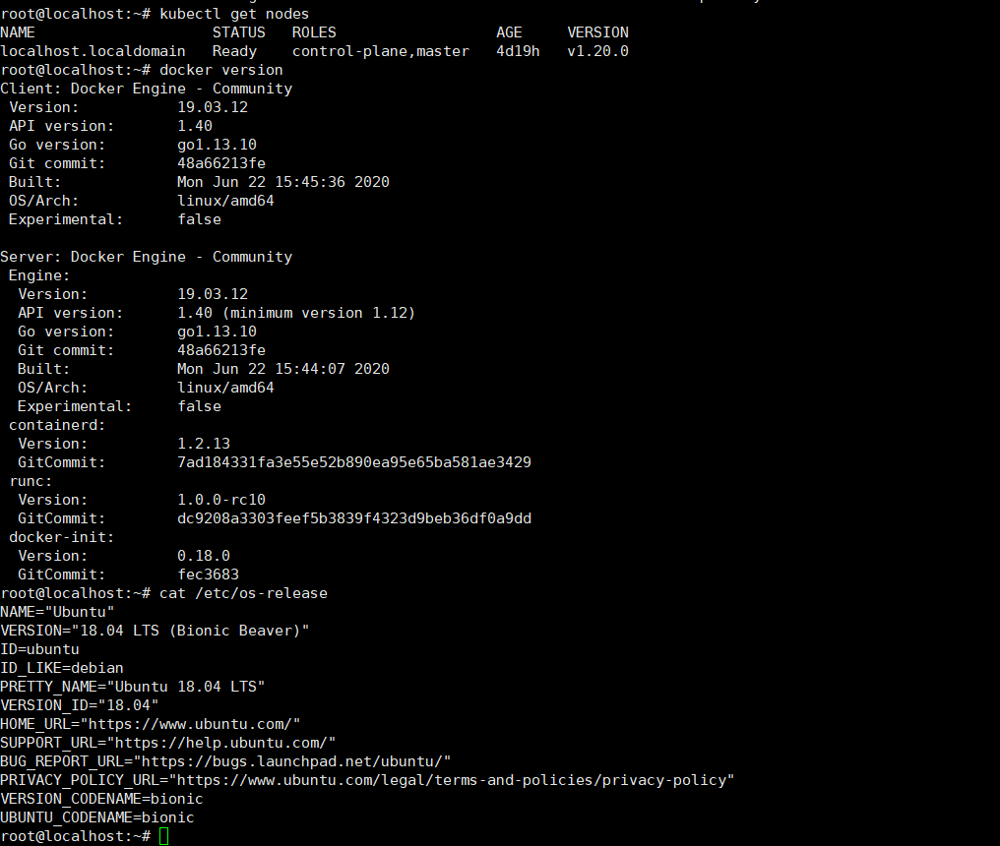
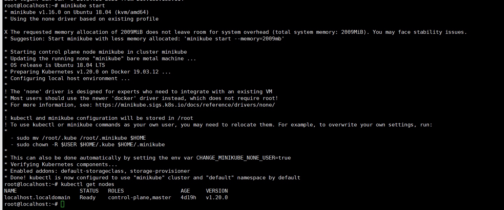

# 部署环境说明
&emsp;本次部署采用搬瓦工VPS虚拟机,配置为2GB内存,40GB硬盘。
- 操作系统为ubuntu18.04  
- docker版本为19.03 
- kubernetes版本为1.20.0



# 开启minikube集群

## 开启minikube集群   
```minikube start```



- 首先部署数据库,采用kubernetes中部署Mysql的方式进行部署。  
执行命令如下:  
```
kubectl create -f namespace_deploy.yaml
kubectl create -f pvc_deploy.yaml
kubectl create -f mysql_deploy.yaml
```

mysql创建完成后如下  


## 资源说明
- k8s 中namespace yaml
```
apiVersion: v1
kind: Namespace
metadata:
  name: liangdu
```
- k8s中pv&pvc的创建yaml
```
---
apiVersion: v1
kind: PersistentVolume
metadata:
  name: mysql-pv-volume
  namespace: liangdu
  labels:
    type: local
spec:
  storageClassName: manual
  capacity:
    storage: 5Gi
  accessModes:
    - ReadWriteOnce
  hostPath:
    path: "/mnt/data"
---
apiVersion: v1
kind: PersistentVolumeClaim
metadata:
  name: mysql-pv-claim
  namespace: liangdu
spec:
  storageClassName: manual
  accessModes:
    - ReadWriteOnce
  resources:
    requests:
      storage: 5Gi
```
- MySQL数据库的K8S版本
```

apiVersion: v1
kind: ConfigMap
metadata:
  name: mysql
  namespace: liangdu
  labels:
    app: mysql
data:
  master.cnf: |
    # Apply this config only on the master.
    [mysqld]
    log-bin
  slave.cnf: |
    # Apply this config only on slaves.
    [mysqld]
    super-read-only
---
## k8s secrete config 
---
apiVersion: v1
kind: Secret
metadata:
  name: secret-credentials
  namespace: liangdu
data: 
  mysql_user: cGVyY2hfb25seQ==
  mysql_password: QjdiOGtSJGRUUQ==
  mysql_root_password: RVk5XmUjWiVMaDhNZmVhJQ==
  #mysql_root_password: MTIz
  mysql_host: bXlzcWwtc2VydmljZQ==
  mysql_db: bW9ydHlfZGIK
  allow_hosts: bG9jYWxob3N0
---
apiVersion: v1
kind: Service
metadata:
  name: mysql
  namespace: liangdu
spec:
  ports:
  - port: 3306
  selector:
    app: mysql
  clusterIP: None
---
apiVersion: apps/v1 # for versions before 1.9.0 use apps/v1beta2
kind: Deployment
metadata:
  name: mysql
  namespace: liangdu
spec:
  selector:
    matchLabels:
      app: mysql
  strategy:
    type: Recreate
  template:
    metadata:
      labels:
        app: mysql
    spec:
      containers:
      - image: mysql:8.0
        name: mysql
        env:
          # Use secret in real usage
        - name: MYSQL_ROOT_PASSWORD
          #value: "123456"
          valueFrom:
            secretKeyRef:
              name: secret-credentials
              key: mysql_root_password
        - name: MYSQL_USER
          valueFrom:
            secretKeyRef:
              name: secret-credentials
              key: mysql_user
        - name: MYSQL_PASSWORD
          valueFrom:
            secretKeyRef:
              name: secret-credentials
              key: mysql_password
        - name: MYSQL_DATABASE
          valueFrom:
            secretKeyRef:
              name: secret-credentials
              key: mysql_db
        ports:
        - containerPort: 3306
          name: mysql
        volumeMounts:
        - name: mysql-persistent-storage
          mountPath: /var/lib/mysql
      volumes:
      - name: mysql-persistent-storage
        persistentVolumeClaim:
          claimName: mysql-pv-claim

```

- nginx的k8s部署yaml
```

apiVersion: v1
kind: ConfigMap
metadata:
  name: nginx
  namespace: liangdu
  labels:
    app: nginx
data:
  master.cnf: |
    # Apply this config only on the master.
    [mysqld]
    log-bin
  slave.cnf: |
    # Apply this config only on slaves.
    [mysqld]
    super-read-only
---
apiVersion: v1
kind: Service
metadata:
  name: nginx
  namespace: liangdu
spec:
  ports:
  - port: 80
  selector:
    app: nginx
  clusterIP: None

---
apiVersion: apps/v1 # for versions before 1.9.0 use apps/v1beta2
kind: Deployment
metadata:
  name: nginx-deployment
  namespace: liangdu
spec:
  selector:
    matchLabels:
      app: nginx
  replicas: 1 # tells deployment to run 2 pods matching the template
  template:
    metadata:
      labels:
        app: nginx
    spec:
      containers:
      - name: nginx
        image: nginx:1.19.6
        ports:
        - containerPort: 80

```

- 部署所需的K8S PV.PVC yaml部署文件

```
---
apiVersion: v1
kind: PersistentVolume
metadata:
  name: mysql-pv-volume
  namespace: liangdu
  labels:
    type: local
spec:
  storageClassName: manual
  capacity:
    storage: 5Gi
  accessModes:
    - ReadWriteOnce
  hostPath:
    path: "/mnt/data"
---
apiVersion: v1
kind: PersistentVolumeClaim
metadata:
  name: mysql-pv-claim
  namespace: liangdu
spec:
  storageClassName: manual
  accessModes:
    - ReadWriteOnce
  resources:
    requests:
      storage: 5Gi
```

- 安装cert-manager
```
kubectl apply -f https://github.com/jetstack/cert-manager/releases/download/v1.1.0/cert-manager.yaml
```

helm安装ingress
```
helm install my-release ingress-nginx/ingress-nginx --set controller.hostNetwork=true,controller.service.type="",controller.kind=DaemonSet --create-namespace   --namespace liangdu


kubectl get -A ValidatingWebhookConfiguration
kubectl delete -A ValidatingWebhookConfiguration ingress-nginx-admission
```
## 项目初始化
### 数据库操作初始化
```

 CREATE USER 'newuser'@'localhost' IDENTIFIED BY 'password';
 CREATE USER 'perch_only'@'%' IDENTIFIED BY 'B7b8kR$dTQ';
 GRANT ALL PRIVILEGES ON morty_db.* TO 'perch_only'@'%';
GRANT ALL PRIVILEGES ON ${DATABASE_NAME} . * TO '${USER_NAME}'@'%';

GRANT ALL PRIVILEGES ON  ${DATABASE_NAME} . * TO '${USER_NAME}'@'%';
```

## 创建部署configmap

# 参考
[1].https://cert-manager.io/docs/installation/kubernetes/


