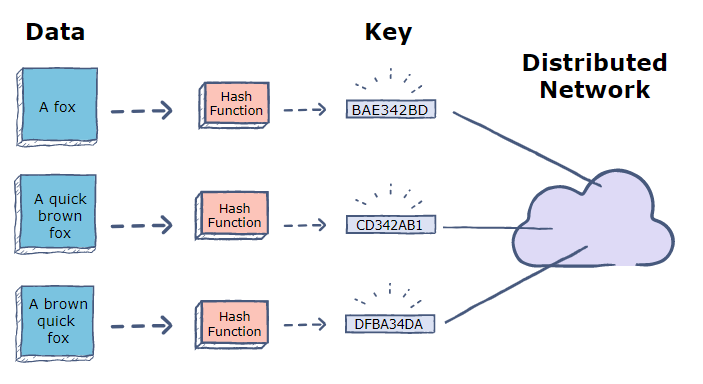
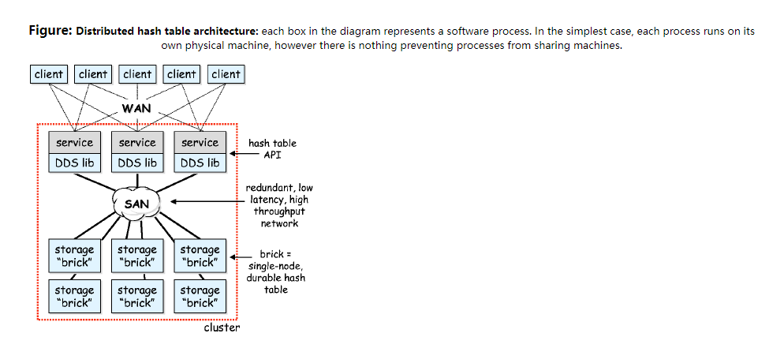
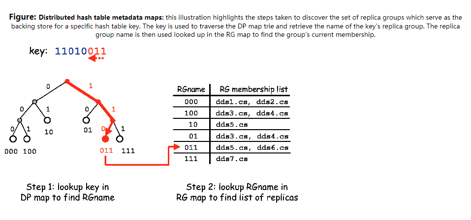
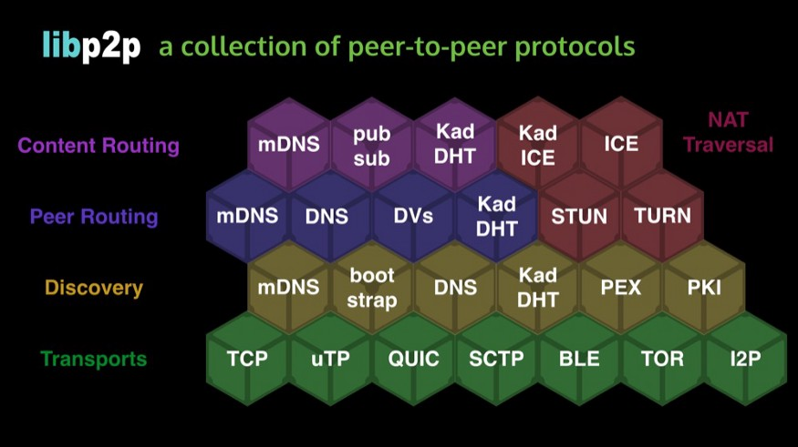

p2p 网络 模块

### 文档说明

|          |                   | 
|----------|:----------------: |
| 作者     |  liangdu          |  
| 联系邮箱 |liangdu@nscc-gz.cn或liangdu1992@gmail.com |
| 发布日期 |    2020-07-09     | 
| 版权所有 | nscc-gz@copyright | 
| 备注     | 无                |


## libp2p库说明与使用

### libp2p 简介
	背景知识:
	IPFS: 
	   “IPFS is a distributed system for storing and accessing files, websites, applications, and data.”
	   ipfs 具有特性如下:
	   - 去中心化
	   - 支持弹性网络
	   - 更难以进行文件内容审查
	   - 加速网络内容获取
       ipfs构成核心:
	   - Content-address 内容标记
	   - 分布式hash表 DHT
	   - Merkle DAGS  
	   - git
	   - bitswap
	   - IPLD
	   - IPNS
	   - Libp2p 网络层 
	   - Self-certifying File system 
	  
       参考:
	   1. https://docs.ipfs.io/
	   2. https://ipfs.io/
	   3. https://zh.wikipedia.org/wiki/%E6%98%9F%E9%99%85%E6%96%87%E4%BB%B6%E7%B3%BB%E7%BB%9F
	   4. https://github.com/ipfs/ipfs
	   5. https://en.wikipedia.org/wiki/Self-certifying_File_System

	P2P网络:
	  "A peer-to-peer (p2p) network is one in which the participants (referred to as peers or nodes) communicate with one another directly, 
	  on more or less “equal footing”. 
	  This does not necessarily mean that all peers are identical; some may have different roles in the overall network.
	  However, one of the defining characteristics of a peer-to-peer network is that they do not require a privileged set of “servers” which behave completely differently from their “clients”,
	  as is the case in the the predominant client / server model."
	p2p网络特性:
	 - 去中心化
	 - 扩展性强
	 - 隐私性
	 - ...等

&emsp;&emsp;libp2p最初作为IPFS项目中的网络层实现，用以解决IPFS项目中IPFS-Node节点的网络联通、数据交换等问题.后来从IPFS项目中分离出来作为独立的网络库，用以解决现代网络环境下构建P2P网络应用的需求。 **libp2p来源于IPFS项目，目前已经从ipfs项目中独立出来作为一个专注于P2P网络的网络库**

> If you’re doing anything in the decentralized, peer-to-peer space, you’ve probably heard of libp2p - a modular networking stack for peer-to-peer applications. libp2p consists of many modular libraries from which p2p network developers can select and reuse just the protocols they need, while making it easy to upgrade and interoperate between applications. This helps web3 developers get up and running faster, build more resilient decentralized applications, and utilize advanced features like decentralized publish-subscribe and a distributed hash table.What makes libp2p different from the networking stack of today is its focus on transport agnosticism, modularity, and portable encodings (like multiaddr). These properties make libp2p the networking layer of choice for most new dweb projects, blockchains, and peer-to-peer applications. Read more about why projects are choosing to build on libp2p, or watch the recent talk from Tech Lead Raul Kripalani at DevCon5.  


 libp2p 特性和适用场景: 
 - [x] Use Serval Transports 适用于多种协议,TCP/UDP/QUIC/WebRTC等 
 - [x] Native Roaming 自适应网络，网络发生变动时程序、服务不需要做额外配置
 - [x] Runtime Freedom 运行时无关，运行平台/软件不影响网络 
 - [x] Protocol Muxing 协议复用.网络连接复用  如: stream multiplexing
 - [x] Work Offline 可自行发现节点，不需要中心服务器或注册服务 如: mdns 节点发现
 - [x] Encrypted Connections 连接加密，通信链路加密和节点加密认证   如: peer identity
 - [x] Upgrade Without Compromises 无感升级
 - [x] Work In the brower 可浏览器中运行
 - [x] Good For High Latency Scenarios 可应用于高延迟场景
   

 libp2p 的实现版本
 - [x] go-libp2p 
 - [x] js-libp2p
 - [x] nodejs-libp2p
 - [x] rust-libp2p


### libp2p 中核心数据结构
- [x] 分布式hash表(Distributed Hash Tables|dht)
  >Ok, they're fundamentally a pretty simple idea. A DHT gives you a dictionary-like interface, but the nodes are distributed across the network. The trick with DHTs is that the node that gets to store a particular key is found by hashing that key, so in effect your hash-table buckets are now independent nodes in a network.
 This gives a lot of fault-tolerance and reliability, and possibly some performance benefit, but it also throws up a lot of headaches. For example, what happens when a node leaves the network, by failing or otherwise? And how do you redistribute keys when a node joins so that the load is roughly balanced. Come to think of it, how do you evenly distribute keys anyhow? And when a node joins, how do you avoid rehashing everything? (Remember you'd have to do this in a normal hash table if you increase the number of buckets).
 One example DHT that tackles some of these problems is a logical ring of n nodes, each taking responsibility for 1/n of the keyspace. Once you add a node to the network, it finds a place on the ring to sit between two other nodes, and takes responsibility for some of the keys in its sibling nodes. The beauty of this approach is that none of the other nodes in the ring are affected; only the two sibling nodes have to redistribute keys.
 For example, say in a three node ring the first node has keys 0-10, the second 11-20 and the third 21-30. If a fourth node comes along and inserts itself between nodes 3 and 0 (remember, they're in a ring), it can take responsibility for say half of 3's keyspace, so now it deals with 26-30 and node 3 deals with 21-25.
 There are many other overlay structures such as this that use content-based routing to find the right node on which to store a key. Locating a key in a ring requires searching round the ring one node at a time (unless you keep a local look-up table, problematic in a DHT of thousands of nodes), which is O(n)-hop routing. Other structures - including augmented rings - guarantee O(log n)-hop routing, and some claim to O(1)-hop routing at the cost of more maintenance.

.
  
  
  
  
  
- [x] Merkle DAGS
### libp2p核心概念

* 传输(Transport)
 参考:  
   - https://docs.libp2p.io/concepts/transport/
* NAT转换(NAT Traversal)
  参考:  
   - https://docs.libp2p.io/concepts/nat/
* 通信安全(Secure Communication)
  参考:  
   - https://docs.libp2p.io/concepts/nat/#automatic-router-configuration
* 中继传输(Circuit Relay)
  参考:  
   - https://docs.libp2p.io/concepts/circuit-relay/
* 传输协议(Protocols)  
  libp2p的核心协议有:
  1. ping 协议
  2. Identify 协议
  3. secio协议
  4. kad-dht 协议
  5. Circuit Relay 协议  
  参考:  
   - https://docs.libp2p.io/concepts/protocols/
* 节点标识(Peer Identify)
 参考:  
   - https://docs.libp2p.io/concepts/peer-id/
*  内容路由 (Content Routing)

* 节点路由 (Peer Routing)

* 地址标识(Addressing)
 参考:  
   - https://docs.libp2p.io/concepts/addressing/
* 安全性考虑(Security Considerations)
 参考:  
   - https://docs.libp2p.io/concepts/security-considerations/
* 发布订阅模式 (Publish/Subscribe)
 参考:  
   - https://docs.libp2p.io/concepts/publish-subscribe/
* 流多路复用 (Stream Mutiplexing)
 参考:  
   - https://docs.libp2p.io/concepts/stream-multiplexing/

### libp2p 使用
- [x] libp2p 库使用通用流程  
 libp2p的使用通常分为以下几个步骤:
 1. 构建libp2p 节点   construct p2p worknode
   ```
    ctx = context.Background()
	node, err = libp2p.New(ctx, option)
	if err != nil {
		return ctx, host.Host(nil), err
	}
   ```
 2. 发布libp2p 节点  publish p2p worknode
   ```
   ctx = context.Background()
	node, err = libp2p.New(ctx, nodeOptions)
	if err != nil {
		return ctx, host.Host(nil), err
	}
   address, err := peerstore.AddrInfoToP2pAddrs(&peerInfo)

   ```
 3. 连接到libp2p 节点 connect to p2p worknode
   ```
   "github.com/libp2p/go-libp2p-core/host"
	var host host.Host
	peerInfo := peerstore.AddrInfo{
		ID:    node.ID(),
		Addrs: node.Addrs(),
	}
	
	host.Connect(ctx,peerinfo)

   ```
 4. 处理节点之间网络流 handle p2p network stream  
 核心方法为:  
 ```$xslt
"github.com/libp2p/go-libp2p-core/host"
var host host.Host
host.SetStreamHander(procolID,streamHandlerMethod)
func streamHandlerMethod(stream network.Stream){
 //todo 业务处理方法
 }
 //示例 streamhandler
 
//todo 默认流处理函数
func Defaulp2pNetworkStreamHandler(stream network.Stream) {
	// stream.Stat().Direction 判断数据流向
	//stream.Conn()  获取连接信息
	//stream.Conn().GetStreams()
	//stream.Conn().NewStream()
	//stream.Conn().LocalPeer()
	//stream.Conn().RemotePeer()
	//...
	//stream.Protocol() 获取协议
	//stream.SetDeadline( ) // 设置过期时间
	//stream.Reset() //重置网络流

	fmt.Printf("got a new stream....")
	rw := bufio.NewReadWriter(bufio.NewReader(stream), bufio.NewWriter(stream))
	str, err := rw.ReadString('\n')
	if err != nil {
		panic(err)
	}
	fmt.Printf("str read from stream is %s \n:", str)

	_, err = rw.Write([]byte(str))
	if err!= nil{
		panic(err)
	}
}
```
 
 5. 节点使用完成后关闭libp2p节点(可选) shutdown p2p worknode  
 核心方法为:
 ```$xslt
"github.com/libp2p/go-libp2p-core/host"
var host host.Host
host.Close()
```
- [x] libp2p 关键库说明
  -
* github.com/libp2p/go-libp2p-core/peer
  > 该包中包含libp2p 中网络节点peer 的表示和描述信息
  >Package peer implements an object used to represent peers in the libp2p network.
* github.com/libp2p/go-libp2p-core/host
  >使用该包来创建libp2p中网络节点
  >Package host provides the core Host interface for libp2p.Host represents a single libp2p node in a peer-to-peer network.
* github.com/libp2p/go-libp2p/p2p/host/routed
  > RoutedHost's Connect differs in that if the host has no addresses for a given peer, it will use its routing system to try to find some.
* github.com/libp2p/go-tcp-transport
  > 该包是libp2p中对tcp传输协议的实现
  > A libp2p transport implementation for tcp, including reuseport socket options.
* github.com/libp2p/go-ws-transport
  > 该包是libp2p中对web-socket传输协议的实现
  > A libp2p transport implementation using WebSockets.
* github.com/libp2p/go-libp2p-yamux
  > libp2p 中对yamux multiplex多路复用的实现
  > An adapter to integrate the yamux multiplexer into libp2p as a stream muxer.
* github.com/libp2p/go-libp2p-mplex
  > libp2p中多路复用的实现
  > This is an implementation of the go-stream-muxer interface for multiplex
* github.com/libp2p/go-libp2p-secio
  > libp2p中安全传输模块
  > go-libp2p-secio is a component of the libp2p project, a modular networking stack for developing peer-to-peer applications. It provides a secure transport channel for go-libp2p. Following an initial plaintext handshake, all data exchanged between peers using go-libp2p-secio is encrypted and protected from eavesdropping.libp2p supports multiple transport protocols, many of which lack native channel security. go-libp2p-secio is designed to work with go-libp2p's "transport upgrader", which applies security modules (like go-libp2p-secio) to an insecure channel. go-libp2p-secio implements the SecureTransport interface, which allows the upgrader to secure any underlying connection

* github.com/libp2p/go-libp2p-kad-dht
  >该包中包含DHT方法的实现，使用分布式hash表进行路由发现和内容发现时需要使用该包
  >dht implements a distributed hash table that satisfies the ipfs routing interface. This DHT is modeled after kademlia with S/Kademlia modifications.
	
* github.com/libp2p/go-libp2p-circuit
  > libp2p中提供中继连接
* github.com/ipfs/go-datastore
  > 抽线数据存储和操作层，当使用DHT相关功能时需要使用，如content-routing
  >Datastore is a generic layer of abstraction for data store and database access. It is a simple API with the aim to enable application development in a datastore-agnostic way, allowing datastores to be swapped seamlessly without changing application code. Thus, one can leverage different datastores with different strengths without committing the application to one datastore throughout its lifetime.

In addition, grouped datastores significantly simplify interesting data access patterns (such as caching and sharding).
* github.com/libp2p/go-libp2p-discovery
  > lib2p中对节点发现功能的实现 通常mdns、content-routing等功能实现时使用
  >This package contains interfaces and utilities for active peer discovery. Peers providing a service use the interface to advertise their presence in some namespace. Vice versa, peers seeking a service use the interface to discover peers that have previously advertised as service providers. The package also includes a baseline implementation for discovery through Content Routing.
* github.com/multiformats/go-multiaddr
  > mutiaddr的go-libp2p实现
  >Multiaddr is a standard way to represent addresses that:
  Support any standard network protocols.
  Self-describe (include protocols).
  Have a binary packed format.
  Have a nice string representation.
  Encapsulate well
* github.com/libp2p/go-libp2p-pubsub
  > go-libp2p中发现订阅模式实现
  >This repo contains the canonical pubsub implementation for libp2p. We currently provide three message router options:
  Floodsub, which is the baseline flooding protocol.Randomsub, which is a simple probabilistic router that propagates to random subsets of peers.
  Gossipsub, which is a more advanced router with mesh formation and gossip propagation. See spec and implementation for more details.
- [x] libp2p库中各模块使用示例demo
  -
* 传输(Transport)
* NAT转换(NAT Traversal)
* 通信安全(Secure Communication)
- [x] 启用节点公私钥认证和传输流量加密
```$xslt
	security := libp2p.Security(secio.ID, secio.New) // 传输加密
	if options.NodeIdentifyPrivStr != "" { //节点身份ID设置
		priv, _, err := utils.GenSecurekeysByStr(options.NodeIdentifyPrivStr)
		p2pnetworkhostOptions = append(p2pnetworkhostOptions, libp2p.Identity(priv))
	} 
	//设置节点启动配置 basic node host
	p2pnetworkhostOptions = append(p2pnetworkhostOptions, security, muxers, transports, listenAddrOptions)
	networknode, err = p2pnetwork.CreatenetworkNodehost(ctx, dhtObj, p2pnetworkhostOptions)
}
```
* 中继传输(Circuit Relay)
- [x] 使用中继节点方式进行节点联通与传输
 ```$xslt
	if option.PeerID != "" { //从命令行参数中获取中转节点PEER
		if option.RelayID != "" { //存在中继节点，则通过中继节点连接
			rawPeerIDWithIP := strings.Split(option.PeerID, "/")
			rawPeerID := rawPeerIDWithIP[len(rawPeerIDWithIP)-1]
			ID, err := peerstore.Decode(rawPeerID)
			logger.Printf("relayID is %s,and peerID is %s and targeID is %s\n", option.RelayID, option.PeerID, ID)
			relayAddr, err := ma.NewMultiaddr(option.RelayID + "/p2p-circuit" + option.PeerID)
			//根据地址信息拿到
			//peer, err := peerstore.AddrInfoFromP2pAddr(relayAddr)
			peer := peerstore.AddrInfo{
				ID:    ID,
				Addrs: []ma.Multiaddr{relayAddr},
			}
			if err = p2pNode.Connect(option.ctx, peer); err != nil {
				logger.Errorf("node %s connect to peer node %s with relayaddr  %s failed ,error is %s ...\n", p2pNode.ID(), option.PeerID, relayAddr, err.Error())
			}
		}
```
* 传输协议(Protocols)  
- [x] 传输协议标识方法
 ```$xslt
	transports := libp2p.ChainOptions(
		libp2p.Transport(tcp.NewTCPTransport),
		libp2p.Transport(ws.New),
	)
	listenAddr := libp2p.ListenAddrStrings(
		"/ip4/172.16.171.94/tcp/0", "/ip6/::/tcp/0/ws")
	p2pOptions = append(p2pOptions, muxers, security, listenAddr, transports)
	
	basicHost, err := libp2p.New(ctx, p2pOptions...)
		
```
* 节点标识(Peer Identify)
   - [x] 采用自定义公私钥方式进行节点标识
 ```$xslt
	// Generate a key pair for this host
	priv, _, err := crypto.GenerateKeyPair(crypto.RSA, 2048)
	if err != nil {
		return nil, nil, err
	}

	ctx := context.Background()

	opts := []libp2p.Option{
		libp2p.ListenAddrStrings(fmt.Sprintf("/ip4/0.0.0.0/tcp/%d", listenPort)),
		libp2p.Identity(priv),
		libp2p.DefaultTransports,
		libp2p.DefaultMuxers,
		libp2p.DefaultSecurity,
		libp2p.NATPortMap(),
	}

	basicHost, err := libp2p.New(ctx, opts...)
	if err != nil {
		return nil, nil, err
	}
```
*  内容路由 (Content Routing)   
  - [x] 基于DHT数据结构的内容发现
 ```$xslt
    dstore := dsync.MutexWrap(ds.NewMapDatastore())
	dhtObj, err := dht.New(ctx, basicHost, dht.Datastore(dstore), dht.Mode(dht.ModeServer))

	// step 3构建 需要存储在分布式dht 数据结果中的数据信息
	//dhtObj := dht.NewDHT(ctx, basicHost, dstore)
	data := []byte("this is some test content")
	hash, _ := mh.Sum(data, mh.SHA2_256, -1)
	contentId := cid.NewCidV1(cid.DagCBOR, hash)
	// step4 发布/共享该数据
	if err = dhtObj.Provide(ctx, contentId, false); err != nil {
		log.Error(err)
	}
	// Make the routed host
	//构造 routed host ，routedhost 为包含dht信息的basichost
	routedHost := rhost.Wrap(basicHost, dhtObj)
	// Bootstrap the host
    dhtObj.Bootstrap(ctx)
	// Build host multiaddress
	hostAddr, _ := ma.NewMultiaddr(fmt.Sprintf("/ipfs/%s", routedHost.ID().Pretty()))

	//dht_1 := dht.New(ctx, basicHost_1, dstore)
	basicHost_addressinfo := peer.AddrInfo{
		ID:    routedHost.ID(),
		Addrs: routedHost.Addrs(),
	}
	//works both 创建相同的dht 对象
	//dhtobj1, err := dht.New(ctx, basicHost_1, dht.Datastore(dstore_1), dht.Mode(dht.ModeServer), dht.BootstrapPeers(basicHost_addressinfo))
	dhtobj1, err := dht.New(ctx, basicHost_1, dht.Datastore(dstore_1), dht.Mode(dht.ModeServer))

	//dtbatch,err := dstore.Batch()
	//dhtobj1  = dht.NewDHTClient(ctx, basicHost_1, dtb)
	routedhost1 := rhost.Wrap(basicHost_1, dhtobj1) //关键点

	if err = dhtobj1.Bootstrap(ctx); err != nil { //关键点
		log.Error(err)
	}
	// 将两个节点进行连接，注意此处是目标节点信息 可通过节点发现、固定参数等形式获取
	if err = routedhost1.Connect(ctx, basicHost_addressinfo); err != nil { //关键点
		log.Error(err)
	}


	for {
		time.Sleep(5 * time.Second)
		//查询提供该内容的节点对象
		peers, err := dhtobj1.FindProviders(ctx, contentId) //关键点
		if err != nil {
			log.Error(err)
		}
		if len(peers) <= 0 {
			log.Println("found zero peers....", peers)
		}
		for _, peer := range peers {
			fmt.Printf("found peer %s provider contedt %s\n", peer, contentId.String())
		}

	}
```
* 节点路由 (Peer Routing)
 - [x] 基于mdns的节点发现与节点路由(原始)
  ```

type discoveryNotifee struct {
	PeerChan chan peer.AddrInfo
}

//interface to be called when new  peer is found
func (n *discoveryNotifee) HandlePeerFound(pi peer.AddrInfo) {
	n.PeerChan <- pi
}

//Initialize the MDNS service
func initMDNS(ctx context.Context, peerhost host.Host, rendezvous string) chan peer.AddrInfo {
	// An hour might be a long long period in practical applications. But this is fine for us
	ser, err := discovery.NewMdnsService(ctx, peerhost, time.Hour, rendezvous)
	if err != nil {
		panic(err)
	}

	//register with service so that we get notified about peer discovery
	n := &discoveryNotifee{}
	n.PeerChan = make(chan peer.AddrInfo)

	ser.RegisterNotifee(n)
	return n.PeerChan
}
```

 - [x] 基于mdns的节点发现与节点路由(dht)
 ```$xslt
// Start a DHT, for use in peer discovery. We can't just make a new DHT
	// client because we want each peer to maintain its own local copy of the
	// DHT, so that the bootstrapping node of the DHT can go down without
	// inhibiting future peer discovery.
	//kademliaDHT, err := dht.New(ctx, host)
	kademliaDHT, err := dht.New(option.ctx, p2pNode, dht.Mode(dht.ModeServer))
	//kademliaDHT, err :=dht.New(ctx, host,dht.Mode(dht.ModeServer),dht.ProtocolPrefix(protocol.ID(config.ProtocolID)))


	// Bootstrap the DHT. In the default configuration, this spawns a Background
	// thread that will refresh the peer table every five minutes.
	logger.Debug("Bootstrapping the DHT")
	if err = kademliaDHT.Bootstrap(ctx); err != nil {
		panic(err)
	}
	// We use a rendezvous point "meet me here" to announce our location.
	// This is like telling your friends to meet you at the Eiffel Tower.
	logger.Info("Announcing ourselves...")
	routingDiscovery := discovery.NewRoutingDiscovery(kademliaDHT)

	discovery.Advertise(ctx, routingDiscovery, config.RendezvousString)
	peerChan, err := routingDiscovery.FindPeers(ctx, config.RendezvousString)

```
* 地址标识(Addressing)
 - [x] 标识节点监听地址
 ```$xslt
	// Generate a key pair for this host
	priv, _, err := crypto.GenerateKeyPair(crypto.RSA, 2048)
	if err != nil {
		return nil, nil, err
	}
	ctx := context.Background()
	opts := []libp2p.Option{
		libp2p.ListenAddrStrings(fmt.Sprintf("/ip4/0.0.0.0/tcp/%d", listenPort)),
		libp2p.Identity(priv),
	}
	basicHost, err := libp2p.New(ctx, opts...)
	if err != nil {
		return nil, nil, err
	}

```

* 安全性考虑(Security Considerations)
* 发布订阅模式 (Publish/Subscribe)  
 - [x] 发布订阅模式使用实例
 ```$xslt
// 发布订阅模式 ，该处可选
	//	pubs ,err := pubsub.NewGossipSub(ctx,p2pnetwork.NetworkBasicHost)
	//pubs, err := pubsub.NewGossipSub(ctx, p2pnetwork.NetworkBasicHost)
	pubs, err := PubsubgossipGen(ctx, networknode.BasicNodeHost)
	if err != nil {
		log.Error(err)
	}
	sub, topsub, err := PubsubtopicsJoin(pubs, Pubsub_Default_Topic)
	if err != nil {
		log.Error(err)
	}

	// 设置mdns发现处理方法
	err = MdnsDiscoverySetup(ctx, networknode.BasicNodeHost, DiscoveryInterval, DiscoveryServiceTag)
	if err != nil {
		log.Error(err)
	}

	go func() {
		for {
			msg := new(PubsubMessage)
			msg.SenderPeer = networknode.BasicNodeHost.ID().Pretty()
			msg.PMessageStr = "hello world"
			msg.SenderFrom = "from localhost"
			err = PubsubTopicPubish(ctx, *msg, topsub, nil)
			if err != nil {
				log.Error(err)
			}
			time.Sleep(3 * time.Second)
		}

	}()
	msgChan := make(chan interface{})

	go PubsubMsgHandler(sub, ctx, networknode.BasicNodeHost, msgChan)

	signalChan := make(chan os.Signal, 1)
	errChan := make(chan error, 1)
	signal.Notify(signalChan, syscall.SIGINT, syscall.SIGTERM)
	for {
		select {
		case msg := <-msgChan:
			fmt.Println("msg from msg chan is:", msg)
			for _, peersFind := range PubsubPeersList(pubs, Pubsub_Default_Topic) {
				peerinfo, err := dhtObj.FindPeer(ctx, peersFind)
				if err != nil {
					continue
				}
				if err = networknode.BasicNodeHost.Connect(ctx, peerinfo); err != nil {
					fmt.Print("connect b")
				}
				fmt.Printf("peer found by dht is %s\n", peerinfo.String())
			}
		}
	}
}

```
* 流多路复用 (Stream Mutiplexing)

核心示例代码如下:
`

`


## 参考资料
1. https://libp2p.io/  [官方网站]
2. https://github.com/libp2p [官方github]
3. https://github.com/libp2p/specs [libp2p 标准规范]
4. https://github.com/libp2p/go-libp2p [libp2p golang 语言实现]
5. https://github.com/libp2p/go-libp2p-examples [go-libp2p 官方example 库]
6. https://docs.ipfs.io/concepts/what-is-ipfs/ [ipfs 官方网站]
7. https://en.wikipedia.org/wiki/Distributed_hash_table [分布式hash表 dht]
8. https://docs.ipfs.io/concepts/dht/ [dht-concepts]
9. https://docs.ipfs.io/ [ipfs]
10. https://www.ietf.org/proceedings/65/slides/plenaryt-2.pdf [dht -slide]


